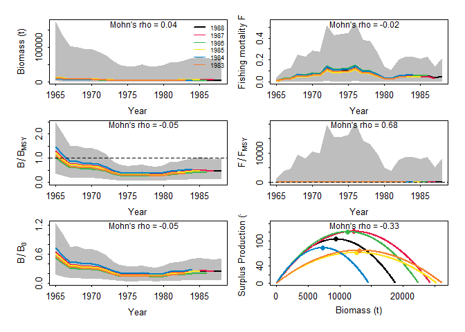

データ
======

`library(spict)`に内蔵のデータを使う

    par(mfrow=c(2,2))
    # Albacore
    plot(dat$albacore$timeC, dat$albacore$obsC, type = "h",
         lwd=2, col = "red", main = "Albacore", ylim = c(0, max(dat$albacore$obsC)),
         xlab = "Year", ylab = "Catch")
    par(new=T)
    plot(dat$albacore$timeI, dat$albacore$obsI, lwd=2,
         type = "l", lty = 2, yaxt = "n",
         xlab = "", ylab = "")
    # Lobster
    plot(dat$lobster$timeC, dat$lobster$obsC, type = "h",
         lwd=2, col = "red", main = "Lobster", ylim = c(0, max(dat$lobster$obsC)),
         xlab = "Year", ylab = "Catch")
    par(new=T)
    plot(dat$lobster$timeI, dat$lobster$obsI, lwd=2,
         type = "l", lty = 2, yaxt = "n",
         xlab = "", ylab = "")
    # Hake
    plot(dat$hake$timeC, dat$hake$obsC, type = "h",
         lwd=2, col = "red", main = "Hake", ylim = c(0, max(dat$hake$obsC)),
         xlab = "Year", ylab = "Catch")
    par(new=T)
    plot(dat$hake$timeI, dat$hake$obsI, lwd=2,
         type = "l", lty = 2, yaxt = "n",
         xlab = "", ylab = "")

-   albacore
    -   意外に時系列が短い
    -   漁獲量はほぼ横ばい
    -   CPUEは淡々と減少
    -   =&gt; プロダクションモデルと相性良くない気がする
-   lobster
    -   `spict`データ内では一番時系列が長い
    -   漁獲量は55年にピークで、そこから少し減ってほぼ横這い
    -   85年からの5年ほどは漁獲量が減少傾向
    -   CPUEは50年代はピーキー
    -   55年以降は単調減少
    -   =&gt;
        CPUE減少、漁獲量一定は相性が悪いけど、時系列が長いのでやりやすいかも？
-   **hake**
    -   時系列は23年と短めだけど十分推定はできると思う
    -   漁獲量も獲れる獲れないのコントラストが一番みられる
    -   漁獲量が落ち込む80年前後に併せて、CPUEも低位になる
    -   82年以降の漁獲量増加とともに、CPUEも上がっていく
    -   =&gt; 増加の情報があって良いのではないか

**今回はHakeのデータを使って比較してみる**

仕様
====

-   データ: Hake

-   形状パラメータ: m=2 (Schaefer型)

-   観測誤差

    -   O: CPUE
    -   X: Catch

-   過程誤差あり

-   事前分布は出来る限り無情報にしてみる

    -   rとKは対数正規になるので、分散を大きく
    -   初期枯渇率は無情報にするとエラーが出るので*α* = *β* = 0.5と台地型に
    -   分散は逆ガンマ分布なので、*α* = *β* = 1として0.5に山が来て、その後なだらかに減少みたいな

データの整理
------------

    dat_hake <- list(
      cpue = data.frame(Year = dat$hake$timeI,
                        CPUE = dat$hake$obsI),
      se = data.frame(Year = dat$hake$timeI,
                      CPUE = rep(NA, length(dat$hake$timeI))),
      catch = data.frame(Year = dat$hake$timeC,
                         catch = dat$hake$obsC)
      )

設定
----

引数の説明

-   事前分布
    -   増加率、環境収容力ともに対数正規型
        -   `"lnorm"`: 平均と分散を指定
        -   `"range"`: 上下限に収まるような対数正規を決めてくれる
    -   初期枯渇率
        -   `"lnorm"`: 平均と分散を指定して対数正規型
        -   `"beta"`: ベータ分布
    -   過程誤差/観測誤差
        -   `"igammma"`: 逆ガンマ分布の*α*と*β*
-   観測誤差の構造
    -   $TOE = \\sqrt{SE^2+sigma.est^2+fixed.obs^2}$
    -   SE（データの変動係数など）は無
    -   `fixed.obs`も無

<!-- -->

    jbinput_hake1 <-  build_jabba(
      catch = dat_hake$catch,
      cpue = dat_hake$cpue,
      se = dat_hake$se,
      assessment="test_hake",
      scenario = "TestRun",
      model.type = "Schaefer",
      add.catch.CV = FALSE,
      # prior sets
      r.dist = "lnorm",
      r.prior = c(0.5,5),
      K.dist = "lnorm",
      K.prior = c(10*max(dat_hake$catch$catch), 20),
      psi.dist = "beta",
      psi.prior = c(0.5,0.5),
      # variance sets
      sigma.proc = TRUE,
      igamma = c(1, 1),
      sigma.est = TRUE, # additional observation variance
      fixed.obsE = 0.)

    ## 
    ##  ><> Prepare JABBA input data <>< 
    ##  
    ## 
    ##  ><> Assume Catch to be known without error <>< 
    ##  
    ## 
    ##  ><> Model type: Schaefer  <>< 
    ## 
    ##  ><> Shape m = 2 
    ## 
    ##  ><> K prior mean = 6060.84 and CV = 20 (log.sd =  2.448257 ) 
    ## 
    ##  ><> r prior mean = 0.5 and CV = 268337.3 (log.sd =  5 ) 
    ## 
    ##  ><> Psi (B1/K) prior mean = 0.5 and CV = 0.5 with beta destribution 
    ## 
    ##  
    ##  
    ##  ><> ALWAYS ENSURE to adjust default settings to your specific stock <>< 
    ## 

### MCMCの実行

    fit_hake1 <- fit_jabba(jbinput_hake1, quickmcmc=TRUE)

    ## module glm loaded

    ## Compiling model graph
    ##    Resolving undeclared variables
    ##    Allocating nodes
    ## Graph information:
    ##    Observed stochastic nodes: 75
    ##    Unobserved stochastic nodes: 54
    ##    Total graph size: 1280
    ## 
    ## Initializing model
    ## 
    ## 
    ## ><> Produce results output of Schaefer model for test_hake TestRun <><
    ## 
    ## 
    ## ><> Scenario TestRun_Schaefer completed in 0 min and 22 sec <><

    knitr::kable(fit_hake1$pars)

<table>
<thead>
<tr class="header">
<th style="text-align: left;"></th>
<th style="text-align: right;">Median</th>
<th style="text-align: right;">LCI</th>
<th style="text-align: right;">UCI</th>
<th style="text-align: right;">Geweke.p</th>
<th style="text-align: right;">Heidel.p</th>
</tr>
</thead>
<tbody>
<tr class="odd">
<td style="text-align: left;">K</td>
<td style="text-align: right;">12451.2897040</td>
<td style="text-align: right;">2359.6573017</td>
<td style="text-align: right;">42048.9566125</td>
<td style="text-align: right;">0.390</td>
<td style="text-align: right;">0.686</td>
</tr>
<tr class="even">
<td style="text-align: left;">r</td>
<td style="text-align: right;">0.0763661</td>
<td style="text-align: right;">0.0000173</td>
<td style="text-align: right;">0.5314994</td>
<td style="text-align: right;">0.266</td>
<td style="text-align: right;">0.517</td>
</tr>
<tr class="odd">
<td style="text-align: left;">q</td>
<td style="text-align: right;">0.0002331</td>
<td style="text-align: right;">0.0000786</td>
<td style="text-align: right;">0.0007192</td>
<td style="text-align: right;">0.251</td>
<td style="text-align: right;">0.491</td>
</tr>
<tr class="even">
<td style="text-align: left;">psi</td>
<td style="text-align: right;">0.7063688</td>
<td style="text-align: right;">0.1998163</td>
<td style="text-align: right;">0.9679023</td>
<td style="text-align: right;">0.159</td>
<td style="text-align: right;">0.604</td>
</tr>
<tr class="odd">
<td style="text-align: left;">sigma2</td>
<td style="text-align: right;">0.0429339</td>
<td style="text-align: right;">0.0372543</td>
<td style="text-align: right;">0.0483963</td>
<td style="text-align: right;">0.758</td>
<td style="text-align: right;">0.774</td>
</tr>
<tr class="even">
<td style="text-align: left;">tau2</td>
<td style="text-align: right;">0.0021416</td>
<td style="text-align: right;">0.0004300</td>
<td style="text-align: right;">0.0125242</td>
<td style="text-align: right;">0.887</td>
<td style="text-align: right;">0.602</td>
</tr>
<tr class="odd">
<td style="text-align: left;">m</td>
<td style="text-align: right;">2.0000000</td>
<td style="text-align: right;">2.0000000</td>
<td style="text-align: right;">2.0000000</td>
<td style="text-align: right;">NaN</td>
<td style="text-align: right;">NA</td>
</tr>
</tbody>
</table>

    knitr::kable(fit_hake1$estimates)

<table>
<thead>
<tr class="header">
<th style="text-align: left;"></th>
<th style="text-align: right;">mu</th>
<th style="text-align: right;">lci</th>
<th style="text-align: right;">uci</th>
</tr>
</thead>
<tbody>
<tr class="odd">
<td style="text-align: left;">K</td>
<td style="text-align: right;">12451.2897040</td>
<td style="text-align: right;">2359.6573017</td>
<td style="text-align: right;">42048.9566125</td>
</tr>
<tr class="even">
<td style="text-align: left;">r</td>
<td style="text-align: right;">0.0763661</td>
<td style="text-align: right;">0.0000173</td>
<td style="text-align: right;">0.5314994</td>
</tr>
<tr class="odd">
<td style="text-align: left;">psi</td>
<td style="text-align: right;">0.7063688</td>
<td style="text-align: right;">0.1998163</td>
<td style="text-align: right;">0.9679023</td>
</tr>
<tr class="even">
<td style="text-align: left;">sigma.proc</td>
<td style="text-align: right;">0.2070000</td>
<td style="text-align: right;">0.1930000</td>
<td style="text-align: right;">0.2200000</td>
</tr>
<tr class="odd">
<td style="text-align: left;">m</td>
<td style="text-align: right;">2.0000000</td>
<td style="text-align: right;">2.0000000</td>
<td style="text-align: right;">2.0000000</td>
</tr>
<tr class="even">
<td style="text-align: left;">Hmsy</td>
<td style="text-align: right;">0.0380000</td>
<td style="text-align: right;">0.0000000</td>
<td style="text-align: right;">0.2660000</td>
</tr>
<tr class="odd">
<td style="text-align: left;">SBmsy</td>
<td style="text-align: right;">6225.6450000</td>
<td style="text-align: right;">1179.8290000</td>
<td style="text-align: right;">21024.4780000</td>
</tr>
<tr class="even">
<td style="text-align: left;">MSY</td>
<td style="text-align: right;">219.3060000</td>
<td style="text-align: right;">0.0800000</td>
<td style="text-align: right;">695.9740000</td>
</tr>
<tr class="odd">
<td style="text-align: left;">bmsyk</td>
<td style="text-align: right;">0.5000000</td>
<td style="text-align: right;">0.5000000</td>
<td style="text-align: right;">0.5000000</td>
</tr>
<tr class="even">
<td style="text-align: left;">P1965</td>
<td style="text-align: right;">0.7470000</td>
<td style="text-align: right;">0.1970000</td>
<td style="text-align: right;">1.2620000</td>
</tr>
<tr class="odd">
<td style="text-align: left;">P1988</td>
<td style="text-align: right;">0.2820000</td>
<td style="text-align: right;">0.0740000</td>
<td style="text-align: right;">0.5280000</td>
</tr>
<tr class="even">
<td style="text-align: left;">B_Bmsy.cur</td>
<td style="text-align: right;">0.5650000</td>
<td style="text-align: right;">0.1480000</td>
<td style="text-align: right;">1.0560000</td>
</tr>
<tr class="odd">
<td style="text-align: left;">H_Hmsy.cur</td>
<td style="text-align: right;">1.9090000</td>
<td style="text-align: right;">0.5850000</td>
<td style="text-align: right;">5322.2250000</td>
</tr>
</tbody>
</table>

### 結果の出力

    jbplot_ppdist(fit_hake1)

    ## 
    ## ><> jbplot_ppist() - prior and posterior distributions  <><

    jbplot_residuals(fit_hake1)

    ## 
    ## ><> jbplot_residuals() - JABBA residual plot  <><

    jbplot_cpuefits(fit_hake1)

    ## 
    ## ><> jbplot_cpue() - fits to CPUE <><

    par(mfrow=c(3,2),mar = c(3.5, 3.5, 0.5, 0.1))
    jbplot_trj(fit_hake1,type="B",add=T)

    ## 
    ## ><> jbplot_trj() - B trajectory  <><

    jbplot_trj(fit_hake1,type="F",add=T)

    ## 
    ## ><> jbplot_trj() - F trajectory  <><

    jbplot_trj(fit_hake1,type="BBmsy",add=T)

    ## 
    ## ><> jbplot_trj() - BBmsy trajectory  <><

    jbplot_trj(fit_hake1,type="FFmsy",add=T)

    ## 
    ## ><> jbplot_trj() - FFmsy trajectory  <><

    jbplot_spphase(fit_hake1,add=T)

    ## 
    ## ><> jbplot_spphase() - JABBA Surplus Production Phase Plot  <><

    jbplot_kobe(fit_hake1,add=T)

    ## 
    ## ><> jbplot_kobe() - Stock Status Plot  <><

    ## Warning in bkfe(gcounts, 6L, alpha, range.x = c(sa, sb), binned = TRUE): Binning
    ## grid too coarse for current (small) bandwidth: consider increasing 'gridsize'

    ## Warning in bkfe(gcounts, 4L, alpha, range.x = c(sa, sb), binned = TRUE): Binning
    ## grid too coarse for current (small) bandwidth: consider increasing 'gridsize'

    ## Warning in bkde2D(x, bandwidth = bandwidth * factor, gridsize = nbins, ...):
    ## Binning grid too coarse for current (small) bandwidth: consider increasing
    ## 'gridsize'

### レトロスペクティブ解析の実行

5年間遡ってみる。

    hc <- jabba_hindcast(jbinput_hake1, peels = 0:5)

    ## Compiling model graph
    ##    Resolving undeclared variables
    ##    Allocating nodes
    ## Graph information:
    ##    Observed stochastic nodes: 75
    ##    Unobserved stochastic nodes: 54
    ##    Total graph size: 1280
    ## 
    ## Initializing model
    ## 
    ## 
    ## ><> Produce results output of Schaefer model for test_hake 0 <><
    ## 
    ## 
    ## ><> Scenario 0_Schaefer completed in 0 min and 44 sec <><
    ## Compiling model graph
    ##    Resolving undeclared variables
    ##    Allocating nodes
    ## Graph information:
    ##    Observed stochastic nodes: 74
    ##    Unobserved stochastic nodes: 55
    ##    Total graph size: 1280
    ## 
    ## Initializing model
    ## 
    ## 
    ## ><> Produce results output of Schaefer model for test_hake 1 <><
    ## 
    ## 
    ## ><> Scenario 1_Schaefer completed in 0 min and 20 sec <><
    ## Compiling model graph
    ##    Resolving undeclared variables
    ##    Allocating nodes
    ## Graph information:
    ##    Observed stochastic nodes: 73
    ##    Unobserved stochastic nodes: 56
    ##    Total graph size: 1280
    ## 
    ## Initializing model
    ## 
    ## 
    ## ><> Produce results output of Schaefer model for test_hake 2 <><
    ## 
    ## 
    ## ><> Scenario 2_Schaefer completed in 0 min and 20 sec <><
    ## Compiling model graph
    ##    Resolving undeclared variables
    ##    Allocating nodes
    ## Graph information:
    ##    Observed stochastic nodes: 72
    ##    Unobserved stochastic nodes: 57
    ##    Total graph size: 1280
    ## 
    ## Initializing model
    ## 
    ## 
    ## ><> Produce results output of Schaefer model for test_hake 3 <><
    ## 
    ## 
    ## ><> Scenario 3_Schaefer completed in 0 min and 19 sec <><
    ## Compiling model graph
    ##    Resolving undeclared variables
    ##    Allocating nodes
    ## Graph information:
    ##    Observed stochastic nodes: 71
    ##    Unobserved stochastic nodes: 58
    ##    Total graph size: 1280
    ## 
    ## Initializing model
    ## 
    ## 
    ## ><> Produce results output of Schaefer model for test_hake 4 <><
    ## 
    ## 
    ## ><> Scenario 4_Schaefer completed in 0 min and 19 sec <><
    ## Compiling model graph
    ##    Resolving undeclared variables
    ##    Allocating nodes
    ## Graph information:
    ##    Observed stochastic nodes: 70
    ##    Unobserved stochastic nodes: 59
    ##    Total graph size: 1280
    ## 
    ## Initializing model
    ## 
    ## 
    ## ><> Produce results output of Schaefer model for test_hake 5 <><
    ## 
    ## 
    ## ><> Scenario 5_Schaefer completed in 0 min and 20 sec <><

    jbplot_retro(hc,as.png = F,single.plots = F)

    ## 
    ## ><> jbplot_retro() - retrospective analysis <><

    ##                  B           F         Bmsy      Fmsy        BtoB0        MSY
    ## 1988    0.14293345 -0.12505842  0.009565364 0.1452857  0.009565364 -0.1506325
    ## 1987   -0.12469124  0.14245400 -0.178223097 0.5318790 -0.178223097 -0.2269178
    ## 1986    0.20714783 -0.17160105 -0.041034725 1.1580713 -0.041034725 -0.5351365
    ## 1985   -0.08794266  0.09642229  0.131199376 0.3299366  0.131199376 -0.2793220
    ## 1984    0.06352279 -0.05972866 -0.155525453 1.2533447 -0.155525453 -0.4552157
    ## rho.mu  0.04019404 -0.02350237 -0.046803707 0.6837035 -0.046803707 -0.3294449

参考資料
========

あまり参考にならないが、[ここ](https://github.com/jabbamodel/JABBA/blob/master/Tutorial_Vignette.md)にJABBAのチュートリアルがある
