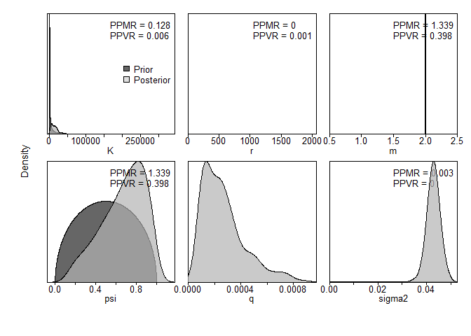
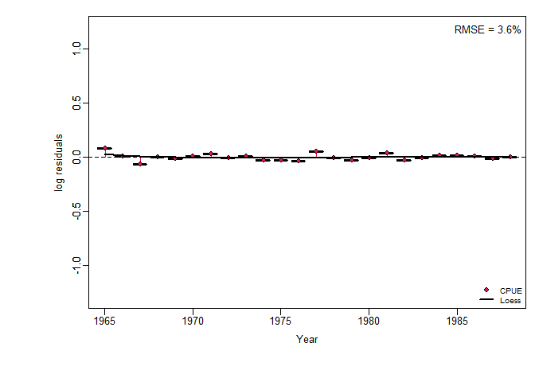
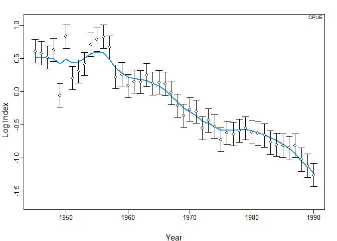
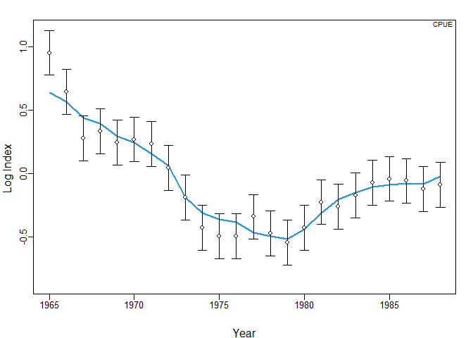

データ
======

`library(spict)`に内蔵のデータを使う

    par(mfrow=c(2,2))
    # Albacore
    plot(dat$albacore$timeC, dat$albacore$obsC, type = "h",
         lwd=2, col = "red", main = "Albacore", ylim = c(0, max(dat$albacore$obsC)),
         xlab = "Year", ylab = "Catch")
    par(new=T)
    plot(dat$albacore$timeI, dat$albacore$obsI, lwd=2,
         type = "l", lty = 2, yaxt = "n",
         xlab = "", ylab = "")
    # Lobster
    plot(dat$lobster$timeC, dat$lobster$obsC, type = "h",
         lwd=2, col = "red", main = "Lobster", ylim = c(0, max(dat$lobster$obsC)),
         xlab = "Year", ylab = "Catch")
    par(new=T)
    plot(dat$lobster$timeI, dat$lobster$obsI, lwd=2,
         type = "l", lty = 2, yaxt = "n",
         xlab = "", ylab = "")
    # Hake
    plot(dat$hake$timeC, dat$hake$obsC, type = "h",
         lwd=2, col = "red", main = "Hake", ylim = c(0, max(dat$hake$obsC)),
         xlab = "Year", ylab = "Catch")
    par(new=T)
    plot(dat$hake$timeI, dat$hake$obsI, lwd=2,
         type = "l", lty = 2, yaxt = "n",
         xlab = "", ylab = "")

-   albacore
    -   意外に時系列が短い
    -   漁獲量はほぼ横ばい
    -   CPUEは淡々と減少
    -   =&gt; プロダクションモデルと相性良くない気がする
-   lobster
    -   `spict`データ内では一番時系列が長い
    -   漁獲量は55年にピークで、そこから少し減ってほぼ横這い
    -   85年からの5年ほどは漁獲量が減少傾向
    -   CPUEは50年代はピーキー
    -   55年以降は単調減少
    -   =&gt;
        CPUE減少、漁獲量一定は相性が悪いけど、時系列が長いのでやりやすいかも？
-   hake
    -   時系列は23年と短めだけど十分推定はできると思う
    -   漁獲量も獲れる獲れないのコントラストが一番みられる
    -   漁獲量が落ち込む80年前後に併せて、CPUEも低位になる
    -   82年以降の漁獲量増加とともに、CPUEも上がっていく
    -   =&gt; 増加の情報があって良いのではないか

Example 1. Albacore
===================

とりあえず解析
--------------

### データの整理

    dat_albacore <- list(
      cpue = data.frame(Year = dat$albacore$timeI,
                        CPUE = dat$albacore$obsI),
      se = data.frame(Year = dat$albacore$timeI,
                      CPUE = rep(NA, length(dat$albacore$timeI))),
      catch = data.frame(Year = dat$albacore$timeC,
                         catch = dat$albacore$obsC)
      )

### 設定

    jbinput_albacore1 <-  build_jabba(
      catch = dat_albacore$catch,
      cpue = dat_albacore$cpue,
      se = dat_albacore$se,
      assessment="test_albacore",
      scenario = "TestRun",
      model.type = "Schaefer",
      add.catch.CV = FALSE,
      # prior sets
      r.dist = "lnorm",
      r.prior = c(0.5,1),
      K.dist = "lnorm",
      K.prior = c(10*max(dat_albacore$catch$catch), 1),
      psi.dist = "beta",
      psi.prior = c(0.05,0.9),
      # variance sets
      sigma.proc = TRUE,
      sigma.est = TRUE, # additional observation variance
      fixed.obsE = 0.)

    ## 
    ##  ><> Prepare JABBA input data <>< 
    ##  
    ## 
    ##  ><> Assume Catch to be known without error <>< 
    ##  
    ## 
    ##  ><> Model type: Schaefer  <>< 
    ## 
    ##  ><> Shape m = 2 
    ## 
    ##  ><> K prior mean = 375 and CV = 1 (log.sd =  0.8325546 ) 
    ## 
    ##  ><> r prior mean = 0.5 and CV = 1.310832 (log.sd =  1 ) 
    ## 
    ##  ><> Psi (B1/K) prior mean = 0.05 and CV = 0.9 with beta destribution 
    ## 
    ##  
    ##  
    ##  ><> ALWAYS ENSURE to adjust default settings to your specific stock <>< 
    ## 

### MCMCの実行

    fit_albacore1 <- fit_jabba(jbinput_albacore1, quickmcmc=TRUE)

    ## module glm loaded

    ## Compiling model graph
    ##    Resolving undeclared variables
    ##    Allocating nodes
    ## Graph information:
    ##    Observed stochastic nodes: 72
    ##    Unobserved stochastic nodes: 52
    ##    Total graph size: 1229
    ## 
    ## Initializing model
    ## 
    ## 
    ## ><> Produce results output of Schaefer model for test_albacore TestRun <><
    ## 
    ## 
    ## ><> Scenario TestRun_Schaefer completed in 0 min and 21 sec <><

    fit_albacore1$estimates

    ##                       mu          lci          uci
    ## K          1925.69441453 849.77806841 3596.9457932
    ## r             0.09450577   0.03815401    0.1861876
    ## psi           0.16102122   0.08715745    0.3014393
    ## sigma.proc    0.06000000   0.03700000    0.1060000
    ## m             2.00000000   2.00000000    2.0000000
    ## Hmsy          0.04700000   0.01900000    0.0930000
    ## SBmsy       962.84700000 424.88900000 1798.4730000
    ## MSY          42.23900000  21.55800000   84.6230000
    ## bmsyk         0.50000000   0.50000000    0.5000000
    ## P1967         0.16300000   0.08600000    0.3080000
    ## P1989         0.05600000   0.03000000    0.1040000
    ## B_Bmsy.cur    0.11200000   0.05900000    0.2090000
    ## H_Hmsy.cur    5.11400000   3.34700000    9.1050000

### 結果の出力

    jbplot_catcherror(fit_albacore1)

    ## 
    ## ><> jbplot_catcherror() only available if add.catch.CV=TRUE <><

    jbplot_ppdist(fit_albacore1)

    ## 
    ## ><> jbplot_ppist() - prior and posterior distributions  <><

    jbplot_cpuefits(fit_albacore1)

    ## 
    ## ><> jbplot_cpue() - fits to CPUE <><

    jbplot_logfits(fit_albacore1)

    ## 
    ## ><> jbplot_logfits()  <><

    par(mfrow=c(3,2),mar = c(3.5, 3.5, 0.5, 0.1))
    jbplot_trj(fit_albacore1,type="B",add=T)

    ## 
    ## ><> jbplot_trj() - B trajectory  <><

    jbplot_trj(fit_albacore1,type="F",add=T)

    ## 
    ## ><> jbplot_trj() - F trajectory  <><

    jbplot_trj(fit_albacore1,type="BBmsy",add=T)

    ## 
    ## ><> jbplot_trj() - BBmsy trajectory  <><

    jbplot_trj(fit_albacore1,type="FFmsy",add=T)

    ## 
    ## ><> jbplot_trj() - FFmsy trajectory  <><

    jbplot_spphase(fit_albacore1,add=T)

    ## 
    ## ><> jbplot_spphase() - JABBA Surplus Production Phase Plot  <><

    jbplot_kobe(fit_albacore1,add=T)

    ## 
    ## ><> jbplot_kobe() - Stock Status Plot  <><

事前分布を無情報にしてみる
--------------------------

JABBAチュートリアルによると

-   増加率と環境収容力
    -   `"range"`とあるが、一様分布の上下限というわけではなさそう
    -   =&gt; 対数正規にした時の上下限のことらしい
    -   `"lnorm"`で誤差を大きくするしかないか…
-   初期枯渇率`psi`はベータ分布だから一様にできる

<!-- -->

    jbinput_albacore2 <-  build_jabba(
      catch = dat_albacore$catch,
      cpue = dat_albacore$cpue,
      se = dat_albacore$se,
      assessment="test_albacore",
      scenario = "TestRun",
      model.type = "Schaefer",
      add.catch.CV = FALSE,
      # prior sets
      r.dist = "lnorm",
      r.prior = c(0.5,2),
      K.dist = "lnorm",
      K.prior = c(10*max(dat_albacore$catch$catch), 10),
      psi.dist = "beta",
      psi.prior = c(1,1),
      # variance sets
      sigma.proc = TRUE,
      sigma.est = TRUE, # additional observation variance
      fixed.obsE = 0.)

    ## 
    ##  ><> Prepare JABBA input data <>< 
    ##  
    ## 
    ##  ><> Assume Catch to be known without error <>< 
    ##  
    ## 
    ##  ><> Model type: Schaefer  <>< 
    ## 
    ##  ><> Shape m = 2 
    ## 
    ##  ><> K prior mean = 375 and CV = 10 (log.sd =  2.148283 ) 
    ## 
    ##  ><> r prior mean = 0.5 and CV = 7.321076 (log.sd =  2 ) 
    ## 
    ##  ><> Psi (B1/K) prior mean = 1 and CV = 1 with beta destribution 
    ## 
    ##  
    ##  
    ##  ><> ALWAYS ENSURE to adjust default settings to your specific stock <>< 
    ## 

### MCMCの実行

    fit_albacore2 <- fit_jabba(jbinput_albacore2) %>% try()

    ## Compiling model graph
    ##    Resolving undeclared variables
    ##    Allocating nodes
    ## Graph information:
    ##    Observed stochastic nodes: 72
    ##    Unobserved stochastic nodes: 52
    ##    Total graph size: 2001227
    ## 
    ## Initializing model
    ## 
    ## 
    ## Error in update.jags(object, n.iter, ...) : Error in node psi
    ## Slicer stuck at value with infinite density

怒られた  
なんだか初期枯渇率`psi`が無限大なった的な  
データのせいなのか、JABBAの特性なのかは分からない

山形ダメだったので、窪地にしてみる
*α* = 0.5, *β* = 0.5

初期枯渇率`psi`とか推定の難しそうなパラメータに対して、事前分布の恩恵が大きいんだろう

    jbinput_albacore2 <-  build_jabba(
      catch = dat_albacore$catch,
      cpue = dat_albacore$cpue,
      se = dat_albacore$se,
      assessment="test_albacore",
      scenario = "TestRun",
      model.type = "Schaefer",
      add.catch.CV = FALSE,
      # prior sets
      r.dist = "lnorm",
      r.prior = c(0.5,10),
      K.dist = "lnorm",
      K.prior = c(10*max(dat_albacore$catch$catch), 10),
      psi.dist = "beta",
      psi.prior = c(0.5,0.5),
      # variance sets
      sigma.proc = TRUE,
      sigma.est = TRUE, # additional observation variance
      fixed.obsE = 0.)

    ## 
    ##  ><> Prepare JABBA input data <>< 
    ##  
    ## 
    ##  ><> Assume Catch to be known without error <>< 
    ##  
    ## 
    ##  ><> Model type: Schaefer  <>< 
    ## 
    ##  ><> Shape m = 2 
    ## 
    ##  ><> K prior mean = 375 and CV = 10 (log.sd =  2.148283 ) 
    ## 
    ##  ><> r prior mean = 0.5 and CV = 5184705528587073093662 (log.sd =  10 ) 
    ## 
    ##  ><> Psi (B1/K) prior mean = 0.5 and CV = 0.5 with beta destribution 
    ## 
    ##  
    ##  
    ##  ><> ALWAYS ENSURE to adjust default settings to your specific stock <>< 
    ## 

    fit_albacore2 <- fit_jabba(jbinput_albacore2, quickmcmc = T) %>% try()

    ## Compiling model graph
    ##    Resolving undeclared variables
    ##    Allocating nodes
    ## Graph information:
    ##    Observed stochastic nodes: 72
    ##    Unobserved stochastic nodes: 52
    ##    Total graph size: 1229
    ## 
    ## Initializing model
    ## 
    ## 
    ## ><> Produce results output of Schaefer model for test_albacore TestRun <><
    ## 
    ## 
    ## ><> Scenario TestRun_Schaefer completed in 0 min and 21 sec <><

### 結果の出力

    jbplot_ppdist(fit_albacore2)

    ## 
    ## ><> jbplot_ppist() - prior and posterior distributions  <><

    jbplot_cpuefits(fit_albacore2)

    ## 
    ## ><> jbplot_cpue() - fits to CPUE <><

    jbplot_logfits(fit_albacore2)

    ## 
    ## ><> jbplot_logfits()  <><

    par(mfrow=c(3,2),mar = c(3.5, 3.5, 0.5, 0.1))
    jbplot_trj(fit_albacore2,type="B",add=T)

    ## 
    ## ><> jbplot_trj() - B trajectory  <><

    jbplot_trj(fit_albacore2,type="F",add=T)

    ## 
    ## ><> jbplot_trj() - F trajectory  <><

    jbplot_trj(fit_albacore2,type="BBmsy",add=T)

    ## 
    ## ><> jbplot_trj() - BBmsy trajectory  <><

    jbplot_trj(fit_albacore2,type="FFmsy",add=T)

    ## 
    ## ><> jbplot_trj() - FFmsy trajectory  <><

    jbplot_spphase(fit_albacore2,add=T)

    ## 
    ## ><> jbplot_spphase() - JABBA Surplus Production Phase Plot  <><

    jbplot_kobe(fit_albacore2,add=T)

    ## 
    ## ><> jbplot_kobe() - Stock Status Plot  <><

    ## Warning in bkfe(gcounts, 6L, alpha, range.x = c(sa, sb), binned = TRUE): Binning
    ## grid too coarse for current (small) bandwidth: consider increasing 'gridsize'

    ## Warning in bkfe(gcounts, 4L, alpha, range.x = c(sa, sb), binned = TRUE): Binning
    ## grid too coarse for current (small) bandwidth: consider increasing 'gridsize'

    ## Warning in bkde2D(x, bandwidth = bandwidth * factor, gridsize = nbins, ...):
    ## Binning grid too coarse for current (small) bandwidth: consider increasing
    ## 'gridsize'

Example 2. Lobster
==================

一番時系列が長いlobsterのデータで解析してみる

    dat_lobster <- list(
      cpue = data.frame(Year = dat$lobster$timeI,
                        CPUE = dat$lobster$obsI),
      se = data.frame(Year = dat$lobster$timeI,
                      CPUE = rep(NA, length(dat$lobster$timeI))),
      catch = data.frame(Year = dat$lobster$timeC,
                         catch = dat$lobster$obsC)
      )

### 設定

    jbinput_lobster1 <-  build_jabba(
      catch = dat_lobster$catch,
      cpue = dat_lobster$cpue,
      se = dat_lobster$se,
      assessment="test_lobster",
      scenario = "TestRun",
      model.type = "Schaefer",
      add.catch.CV = FALSE,
      # prior sets
      r.dist = "lnorm",
      r.prior = c(0.5,1.5),
      K.dist = "lnorm",
      K.prior = c(max(dat_lobster$catch$catch), 5),
      psi.dist = "beta",
      psi.prior = c(0.5,0.5),
      # variance sets
      sigma.proc = TRUE,
      sigma.est = TRUE, # additional observation variance
      fixed.obsE = 0.)

    ## 
    ##  ><> Prepare JABBA input data <>< 
    ##  
    ## 
    ##  ><> Assume Catch to be known without error <>< 
    ##  
    ## 
    ##  ><> Model type: Schaefer  <>< 
    ## 
    ##  ><> Shape m = 2 
    ## 
    ##  ><> K prior mean = 6547 and CV = 5 (log.sd =  1.80502 ) 
    ## 
    ##  ><> r prior mean = 0.5 and CV = 2.913372 (log.sd =  1.5 ) 
    ## 
    ##  ><> Psi (B1/K) prior mean = 0.5 and CV = 0.5 with beta destribution 
    ## 
    ##  
    ##  
    ##  ><> ALWAYS ENSURE to adjust default settings to your specific stock <>< 
    ## 

### MCMCの実行

    fit_lobster1 <- fit_jabba(jbinput_lobster1, quickmcmc=TRUE)

    ## Compiling model graph
    ##    Resolving undeclared variables
    ##    Allocating nodes
    ## Graph information:
    ##    Observed stochastic nodes: 141
    ##    Unobserved stochastic nodes: 98
    ##    Total graph size: 2380
    ## 
    ## Initializing model
    ## 
    ## 
    ## ><> Produce results output of Schaefer model for test_lobster TestRun <><
    ## 
    ## 
    ## ><> Scenario TestRun_Schaefer completed in 0 min and 43 sec <><

    fit_lobster1$pars

    ##                    Median               LCI               UCI Geweke.p Heidel.p
    ## K      112553.86061530426 62878.20766165113 280990.5197059935    0.558    0.600
    ## r           0.12035633354     0.01953223385      0.2666553945    0.752    0.870
    ## q           0.00003415617     0.00001467221      0.0000591538    0.259    0.573
    ## psi         0.80875615581     0.54202567173      0.9785848303    0.084    0.068
    ## sigma2      0.00568040444     0.00197002783      0.0169060602    0.951    0.790
    ## tau2        0.01341667665     0.00254085884      0.0324920633    0.498    0.804
    ## m           2.00000000000     2.00000000000      2.0000000000      NaN       NA

    fit_lobster1$estimates

    ##                        mu            lci            uci
    ## K          112553.8606153 62878.20766165 280990.5197060
    ## r               0.1203563     0.01953223      0.2666554
    ## psi             0.8087562     0.54202567      0.9785848
    ## sigma.proc      0.0750000     0.04400000      0.1300000
    ## m               2.0000000     2.00000000      2.0000000
    ## Hmsy            0.0600000     0.01000000      0.1330000
    ## SBmsy       56276.9300000 31439.10400000 140495.2600000
    ## MSY          3406.0830000  1161.01900000   5028.2950000
    ## bmsyk           0.5000000     0.50000000      0.5000000
    ## P1945           0.8180000     0.55300000      1.0620000
    ## P1990           0.1410000     0.09200000      0.2120000
    ## B_Bmsy.cur      0.2820000     0.18500000      0.4250000
    ## H_Hmsy.cur      2.9130000     1.79000000      9.0540000

### 結果の出力

    jbplot_ppdist(fit_lobster1)

    ## 
    ## ><> jbplot_ppist() - prior and posterior distributions  <><

    jbplot_cpuefits(fit_lobster1)

    ## 
    ## ><> jbplot_cpue() - fits to CPUE <><

    jbplot_logfits(fit_lobster1)

    ## 
    ## ><> jbplot_logfits()  <><

    par(mfrow=c(3,2),mar = c(3.5, 3.5, 0.5, 0.1))
    jbplot_trj(fit_lobster1,type="B",add=T)

    ## 
    ## ><> jbplot_trj() - B trajectory  <><

    jbplot_trj(fit_lobster1,type="F",add=T)

    ## 
    ## ><> jbplot_trj() - F trajectory  <><

    jbplot_trj(fit_lobster1,type="BBmsy",add=T)

    ## 
    ## ><> jbplot_trj() - BBmsy trajectory  <><

    jbplot_trj(fit_lobster1,type="FFmsy",add=T)

    ## 
    ## ><> jbplot_trj() - FFmsy trajectory  <><

    jbplot_spphase(fit_lobster1,add=T)

    ## 
    ## ><> jbplot_spphase() - JABBA Surplus Production Phase Plot  <><

    jbplot_kobe(fit_lobster1,add=T)

    ## 
    ## ><> jbplot_kobe() - Stock Status Plot  <><

    ## Warning in bkde2D(x, bandwidth = bandwidth * factor, gridsize = nbins, ...):
    ## Binning grid too coarse for current (small) bandwidth: consider increasing
    ## 'gridsize'

Example 3. Hake
===============

増加の情報がありそうなHakeのデータで解析してみる

    dat_hake <- list(
      cpue = data.frame(Year = dat$hake$timeI,
                        CPUE = dat$hake$obsI),
      se = data.frame(Year = dat$hake$timeI,
                      CPUE = rep(NA, length(dat$hake$timeI))),
      catch = data.frame(Year = dat$hake$timeC,
                         catch = dat$hake$obsC)
      )

### 設定

    jbinput_hake1 <-  build_jabba(
      catch = dat_hake$catch,
      cpue = dat_hake$cpue,
      se = dat_hake$se,
      assessment="test_hake",
      scenario = "TestRun",
      model.type = "Schaefer",
      add.catch.CV = FALSE,
      # prior sets
      r.dist = "lnorm",
      r.prior = c(0.5,1.5),
      K.dist = "lnorm",
      K.prior = c(max(dat_hake$catch$catch), 5),
      psi.dist = "beta",
      psi.prior = c(0.5,0.5),
      # variance sets
      sigma.proc = TRUE,
      sigma.est = TRUE, # additional observation variance
      fixed.obsE = 0.)

    ## 
    ##  ><> Prepare JABBA input data <>< 
    ##  
    ## 
    ##  ><> Assume Catch to be known without error <>< 
    ##  
    ## 
    ##  ><> Model type: Schaefer  <>< 
    ## 
    ##  ><> Shape m = 2 
    ## 
    ##  ><> K prior mean = 606.084 and CV = 5 (log.sd =  1.80502 ) 
    ## 
    ##  ><> r prior mean = 0.5 and CV = 2.913372 (log.sd =  1.5 ) 
    ## 
    ##  ><> Psi (B1/K) prior mean = 0.5 and CV = 0.5 with beta destribution 
    ## 
    ##  
    ##  
    ##  ><> ALWAYS ENSURE to adjust default settings to your specific stock <>< 
    ## 

### MCMCの実行

    fit_hake1 <- fit_jabba(jbinput_hake1, quickmcmc=TRUE)

    ## Compiling model graph
    ##    Resolving undeclared variables
    ##    Allocating nodes
    ## Graph information:
    ##    Observed stochastic nodes: 75
    ##    Unobserved stochastic nodes: 54
    ##    Total graph size: 1280
    ## 
    ## Initializing model
    ## 
    ## 
    ## ><> Produce results output of Schaefer model for test_hake TestRun <><
    ## 
    ## 
    ## ><> Scenario TestRun_Schaefer completed in 0 min and 20 sec <><

    fit_hake1$estimates

    ##                      mu         lci          uci
    ## K          3062.0031019 2195.383341 5718.0444442
    ## r             0.3455666    0.166329    0.5184668
    ## psi           0.9352060    0.752944    0.9939963
    ## sigma.proc    0.0610000    0.036000    0.1120000
    ## m             2.0000000    2.000000    2.0000000
    ## Hmsy          0.1730000    0.083000    0.2590000
    ## SBmsy      1531.0020000 1097.692000 2859.0220000
    ## MSY         266.2780000  209.073000  318.4800000
    ## bmsyk         0.5000000    0.500000    0.5000000
    ## P1965         0.9870000    0.785000    1.1790000
    ## P1988         0.5130000    0.376000    0.6450000
    ## B_Bmsy.cur    1.0250000    0.752000    1.2910000
    ## H_Hmsy.cur    0.7770000    0.575000    1.2110000

### 結果の出力

    jbplot_ppdist(fit_hake1)

    ## 
    ## ><> jbplot_ppist() - prior and posterior distributions  <><

    jbplot_cpuefits(fit_hake1)

    ## 
    ## ><> jbplot_cpue() - fits to CPUE <><

    jbplot_logfits(fit_hake1)

    ## 
    ## ><> jbplot_logfits()  <><

    par(mfrow=c(3,2),mar = c(3.5, 3.5, 0.5, 0.1))
    jbplot_trj(fit_hake1,type="B",add=T)

    ## 
    ## ><> jbplot_trj() - B trajectory  <><

    jbplot_trj(fit_hake1,type="F",add=T)

    ## 
    ## ><> jbplot_trj() - F trajectory  <><

    jbplot_trj(fit_hake1,type="BBmsy",add=T)

    ## 
    ## ><> jbplot_trj() - BBmsy trajectory  <><

    jbplot_trj(fit_hake1,type="FFmsy",add=T)

    ## 
    ## ><> jbplot_trj() - FFmsy trajectory  <><

    jbplot_spphase(fit_hake1,add=T)

    ## 
    ## ><> jbplot_spphase() - JABBA Surplus Production Phase Plot  <><

    jbplot_kobe(fit_hake1,add=T)

    ## 
    ## ><> jbplot_kobe() - Stock Status Plot  <><

