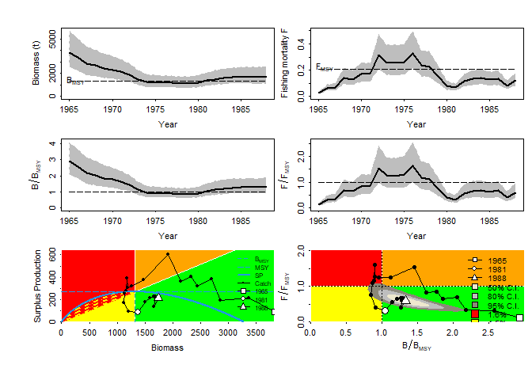
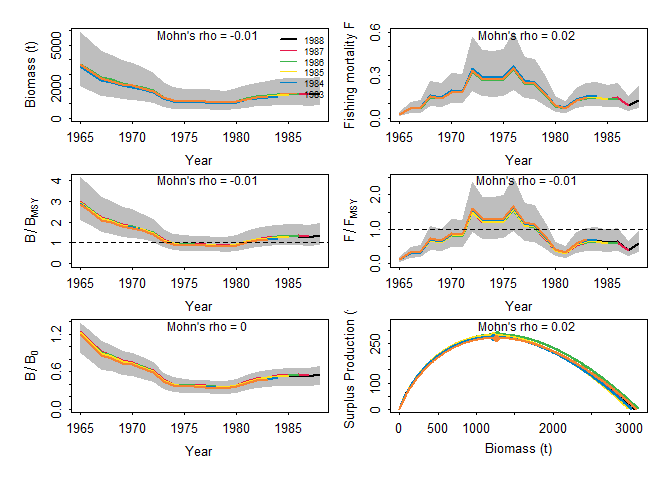
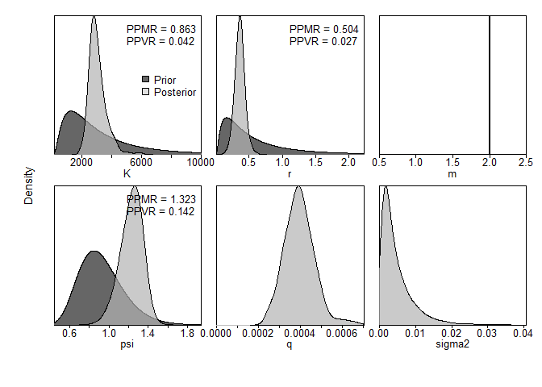

-   [データ](#データ)
-   [シナリオ1](#シナリオ1)
    -   [データの整理](#データの整理)
    -   [設定](#設定)
        -   [MCMCの実行](#mcmcの実行)
        -   [結果の出力](#結果の出力)
-   [シナリオ1 (事前分布強め)](#シナリオ1-事前分布強め)
    -   [レトロスペクティブ解析の実行](#レトロスペクティブ解析の実行)
-   [シナリオ2](#シナリオ2)
    -   [レトロスペクティブ解析の実行](#レトロスペクティブ解析の実行-1)
-   [シナリオ3](#シナリオ3)
    -   [レトロスペクティブ解析の実行](#レトロスペクティブ解析の実行-2)
-   [参考資料](#参考資料)

データ
======

`library(spict)`に内蔵のデータを使う

``` r
par(mfrow=c(2,2))
# Albacore
plot(dat$albacore$timeC, dat$albacore$obsC, type = "h",
     lwd=2, col = "red", main = "Albacore", ylim = c(0, max(dat$albacore$obsC)),
     xlab = "Year", ylab = "Catch")
par(new=T)
plot(dat$albacore$timeI, dat$albacore$obsI, lwd=2,
     type = "l", lty = 2, yaxt = "n",
     xlab = "", ylab = "")
# Lobster
plot(dat$lobster$timeC, dat$lobster$obsC, type = "h",
     lwd=2, col = "red", main = "Lobster", ylim = c(0, max(dat$lobster$obsC)),
     xlab = "Year", ylab = "Catch")
par(new=T)
plot(dat$lobster$timeI, dat$lobster$obsI, lwd=2,
     type = "l", lty = 2, yaxt = "n",
     xlab = "", ylab = "")
# Hake
plot(dat$hake$timeC, dat$hake$obsC, type = "h",
     lwd=2, col = "red", main = "Hake", ylim = c(0, max(dat$hake$obsC)),
     xlab = "Year", ylab = "Catch")
par(new=T)
plot(dat$hake$timeI, dat$hake$obsI, lwd=2,
     type = "l", lty = 2, yaxt = "n",
     xlab = "", ylab = "")
```


-   albacore
    -   意外に時系列が短い
    -   漁獲量はほぼ横ばい
    -   CPUEは淡々と減少
    -   =\> プロダクションモデルと相性良くない気がする
-   lobster
    -   `spict`データ内では一番時系列が長い
    -   漁獲量は55年にピークで、そこから少し減ってほぼ横這い
    -   85年からの5年ほどは漁獲量が減少傾向
    -   CPUEは50年代はピーキー
    -   55年以降は単調減少
    -   =\>
        CPUE減少、漁獲量一定は相性が悪いけど、時系列が長いのでやりやすいかも？
-   **hake**
    -   時系列は23年と短めだけど十分推定はできると思う
    -   漁獲量も獲れる獲れないのコントラストが一番みられる
    -   漁獲量が落ち込む80年前後に併せて、CPUEも低位になる
    -   82年以降の漁獲量増加とともに、CPUEも上がっていく
    -   =\> 増加の情報があって良いのではないか

<font color="Red">**今回はHakeのデータを使って比較してみる**</font>

シナリオ1
=========

-   データ: Hake

-   形状パラメータ: m=2 (Schaefer型)

-   観測誤差

    -   O: CPUE
    -   O: Catch

-   過程誤差あり

-   事前分布は出来る限り無情報にしてみる

    -   rとKは対数正規になるので、分散を大きく
    -   初期枯渇率は無情報にするとエラーが出るので*α* = *β* = 0.5と台地型に
    -   分散は逆ガンマ分布なので、*α* = *β* = 1として0.5に山が来て、その後なだらかに減少みたいな

データの整理
------------

``` r
dat_hake <- list(
  cpue = data.frame(Year = dat$hake$timeI,
                    CPUE = dat$hake$obsI),
  se = data.frame(Year = dat$hake$timeI,
                  CPUE = rep(NA, length(dat$hake$timeI))),
  catch = data.frame(Year = dat$hake$timeC,
                     catch = dat$hake$obsC)
  )
```

設定
----

引数の説明

-   事前分布
    -   増加率、環境収容力ともに対数正規型
        -   `"lnorm"`: 平均と分散を指定
        -   `"range"`: 上下限に収まるような対数正規を決めてくれる
    -   初期枯渇率
        -   `"lnorm"`: 平均と分散を指定して対数正規型
        -   `"beta"`: ベータ分布
    -   過程誤差/観測誤差
        -   `"igammma"`: 逆ガンマ分布の*α*と*β*
-   観測誤差の構造
    -   $TOE = \\sqrt{SE^2+sigma.est^2+fixed.obs^2}$
    -   SE（データの変動係数など）は無
    -   `fixed.obs`も無

``` r
jbinput_hake1 <-  build_jabba(
  catch = dat_hake$catch,
  cpue = dat_hake$cpue,
  se = dat_hake$se,
  assessment="test_hake",
  scenario = "TestRun",
  model.type = "Schaefer",
  add.catch.CV = TRUE,
  # prior sets
  r.dist = "lnorm",
  r.prior = c(0.5,5),
  K.dist = "lnorm",
  K.prior = c(10*max(dat_hake$catch$catch), 20),
  psi.dist = "beta",
  psi.prior = c(0.5,0.5),
  # variance sets
  sigma.proc = TRUE,
  igamma = c(1, 1),
  sigma.est = TRUE, # additional observation variance
  fixed.obsE = 0.)
```

    ## 
    ##  ><> Prepare JABBA input data <>< 
    ##  
    ## 
    ##  ><> Assume Catch with error CV =  0.1  <>< 
    ##  
    ## 
    ##  ><> Model type: Schaefer  <>< 
    ## 
    ##  ><> Shape m = 2 
    ## 
    ##  ><> K prior mean = 6060.84 and CV = 20 (log.sd =  2.448257 ) 
    ## 
    ##  ><> r prior mean = 0.5 and CV = 268337.3 (log.sd =  5 ) 
    ## 
    ##  ><> Psi (B1/K) prior mean = 0.5 and CV = 0.5 with beta destribution 
    ## 
    ##  
    ##  
    ##  ><> ALWAYS ENSURE to adjust default settings to your specific stock <>< 
    ## 

### MCMCの実行

``` r
fit_hake1 <- fit_jabba(jbinput_hake1, quickmcmc=TRUE)
```

    ## module glm loaded

    ## Compiling model graph
    ##    Resolving undeclared variables
    ##    Allocating nodes
    ## Graph information:
    ##    Observed stochastic nodes: 75
    ##    Unobserved stochastic nodes: 78
    ##    Total graph size: 1352
    ## 
    ## Initializing model
    ## 
    ## 
    ## ><> Produce results output of Schaefer model for test_hake TestRun <><
    ## 
    ## 
    ## ><> Scenario TestRun_Schaefer completed in 0 min and 25 sec <><

``` r
knitr::kable(fit_hake1$pars)
```

|        |         Median|           LCI|            UCI|  Geweke.p|  Heidel.p|
|:-------|--------------:|-------------:|--------------:|---------:|---------:|
| K      |  12569.9458380|  3347.5073842|  25639.4058677|     0.344|     0.480|
| r      |      0.0486152|     0.0000221|      0.4083150|     0.341|     0.392|
| q      |      0.0001947|     0.0000929|      0.0005554|     0.212|     0.612|
| psi    |      0.7153458|     0.2933967|      0.9668896|     0.727|     0.438|
| sigma2 |      0.0428862|     0.0369537|      0.0484069|     0.451|     0.348|
| tau2   |      0.0020413|     0.0003701|      0.0117420|     0.566|     0.264|
| m      |      2.0000000|     2.0000000|      2.0000000|       NaN|        NA|

``` r
knitr::kable(fit_hake1$estimates)
```

|             |             mu|           lci|            uci|
|:------------|--------------:|-------------:|--------------:|
| K           |  12569.9458380|  3347.5073842|  25639.4058677|
| r           |      0.0486152|     0.0000221|      0.4083150|
| psi         |      0.7153458|     0.2933967|      0.9668896|
| sigma.proc  |      0.2070000|     0.1920000|      0.2200000|
| m           |      2.0000000|     2.0000000|      2.0000000|
| Hmsy        |      0.0240000|     0.0000000|      0.2040000|
| SBmsy       |   6284.9730000|  1673.7540000|  12819.7030000|
| MSY         |    158.9610000|     0.0760000|    595.1300000|
| bmsyk       |      0.5000000|     0.5000000|      0.5000000|
| P1965       |      0.7430000|     0.2960000|      1.2310000|
| P1988       |      0.2820000|     0.1110000|      0.5010000|
| B\_Bmsy.cur |      0.5640000|     0.2210000|      1.0020000|
| H\_Hmsy.cur |      2.5580000|     0.6230000|   5003.8290000|

### 結果の出力

``` r
jbplot_ppdist(fit_hake1)
```

    ## 
    ## ><> jbplot_ppist() - prior and posterior distributions  <><


``` r
par(mfrow = c(1,2))
jbplot_residuals(fit_hake1)
```

    ## 
    ## ><> jbplot_residuals() - JABBA residual plot  <><


``` r
jbplot_cpuefits(fit_hake1)
```

    ## 
    ## ><> jbplot_cpue() - fits to CPUE <><


``` r
par(mfrow=c(3,2),mar = c(3.5, 3.5, 0.5, 0.1))
jbplot_trj(fit_hake1,type="B",add=T)
```

    ## 
    ## ><> jbplot_trj() - B trajectory  <><

``` r
jbplot_trj(fit_hake1,type="F",add=T)
```

    ## 
    ## ><> jbplot_trj() - F trajectory  <><

``` r
jbplot_trj(fit_hake1,type="BBmsy",add=T)
```

    ## 
    ## ><> jbplot_trj() - BBmsy trajectory  <><

``` r
jbplot_trj(fit_hake1,type="FFmsy",add=T)
```

    ## 
    ## ><> jbplot_trj() - FFmsy trajectory  <><

``` r
jbplot_spphase(fit_hake1,add=T)
```

    ## 
    ## ><> jbplot_spphase() - JABBA Surplus Production Phase Plot  <><

``` r
jbplot_kobe(fit_hake1,add=T)
```

    ## 
    ## ><> jbplot_kobe() - Stock Status Plot  <><

    ## Warning in bkfe(gcounts, 6L, alpha, range.x = c(sa, sb), binned = TRUE): Binning
    ## grid too coarse for current (small) bandwidth: consider increasing 'gridsize'

    ## Warning in bkfe(gcounts, 4L, alpha, range.x = c(sa, sb), binned = TRUE): Binning
    ## grid too coarse for current (small) bandwidth: consider increasing 'gridsize'

    ## Warning in bkde2D(x, bandwidth = bandwidth * factor, gridsize = nbins, ...):
    ## Binning grid too coarse for current (small) bandwidth: consider increasing
    ## 'gridsize'


SPICTと結果が違う

-   JABBAの方が不確実性を大きく推定するように見える(MCMCだから?)
-   JABBAのF/Fmsyとかは現実的に見えない
-   事前分布を無情報にするのが無理なのかな…

シナリオ1 (事前分布強め)
========================

``` r
jbinput_hake1.2 <-  build_jabba(
  catch = dat_hake$catch,
  cpue = dat_hake$cpue,
  se = dat_hake$se,
  assessment="test_hake",
  scenario = "TestRun",
  model.type = "Schaefer",
  add.catch.CV = TRUE,
  catch.cv = 0.19,
  # prior sets
  r.dist = "lnorm",
  r.prior = c(0.46,1),
  K.dist = "lnorm",
  K.prior = c(2407, 1),
  # variance sets
  sigma.proc = TRUE,
  igamma = c(1, 1),
  sigma.est = TRUE, # additional observation variance
  fixed.obsE = 0.)
```

    ## 
    ##  ><> Prepare JABBA input data <>< 
    ##  
    ## 
    ##  ><> Assume Catch with error CV =  0.19  <>< 
    ##  
    ## 
    ##  ><> Model type: Schaefer  <>< 
    ## 
    ##  ><> Shape m = 2 
    ## 
    ##  ><> K prior mean = 2407 and CV = 1 (log.sd =  0.8325546 ) 
    ## 
    ##  ><> r prior mean = 0.46 and CV = 1.310832 (log.sd =  1 ) 
    ## 
    ##  ><> Psi (B1/K) prior mean = 0.9 and CV = 0.25 with lnorm destribution 
    ## 
    ##  
    ##  
    ##  ><> ALWAYS ENSURE to adjust default settings to your specific stock <>< 
    ## 

``` r
fit_hake1.2 <- fit_jabba(jbinput_hake1.2, quickmcmc=TRUE)
```

    ## Compiling model graph
    ##    Resolving undeclared variables
    ##    Allocating nodes
    ## Graph information:
    ##    Observed stochastic nodes: 75
    ##    Unobserved stochastic nodes: 78
    ##    Total graph size: 1356
    ## 
    ## Initializing model
    ## 
    ## 
    ## ><> Produce results output of Schaefer model for test_hake TestRun <><
    ## 
    ## 
    ## ><> Scenario TestRun_Schaefer completed in 0 min and 25 sec <><

``` r
knitr::kable(fit_hake1.2$pars)
```

|        |        Median|           LCI|           UCI|  Geweke.p|  Heidel.p|
|:-------|-------------:|-------------:|-------------:|---------:|---------:|
| K      |  3562.6967130|  1755.1086909|  7435.9598955|     0.336|     0.922|
| r      |     0.3335362|     0.1199745|     0.6974814|     0.558|     0.373|
| q      |     0.0004248|     0.0002074|     0.0007836|     0.684|     0.785|
| psi    |     1.0189037|     0.6750367|     1.4424293|     0.546|     0.242|
| sigma2 |     0.0427587|     0.0366681|     0.0481016|     0.414|     0.437|
| tau2   |     0.0021802|     0.0004040|     0.0131538|     0.632|     0.531|
| m      |     2.0000000|     2.0000000|     2.0000000|       NaN|        NA|

``` r
knitr::kable(fit_hake1.2$estimates)
```

|             |            mu|           lci|           uci|
|:------------|-------------:|-------------:|-------------:|
| K           |  3562.6967130|  1755.1086909|  7435.9598955|
| r           |     0.3335362|     0.1199745|     0.6974814|
| psi         |     1.0189037|     0.6750367|     1.4424293|
| sigma.proc  |     0.2070000|     0.1910000|     0.2190000|
| m           |     2.0000000|     2.0000000|     2.0000000|
| Hmsy        |     0.1670000|     0.0600000|     0.3490000|
| SBmsy       |  1781.3480000|   877.5540000|  3717.9800000|
| MSY         |   292.2470000|   150.2130000|   451.7360000|
| bmsyk       |     0.5000000|     0.5000000|     0.5000000|
| P1965       |     1.1480000|     0.6800000|     1.3570000|
| P1988       |     0.4400000|     0.2530000|     0.6090000|
| B\_Bmsy.cur |     0.8810000|     0.5060000|     1.2180000|
| H\_Hmsy.cur |     0.8450000|     0.4870000|     1.7970000|

-   KはSPICT(2407)より大きめ
-   代わりにrはSPICT(0.46)より小さめ

``` r
jbplot_ppdist(fit_hake1.2)
```

    ## 
    ## ><> jbplot_ppist() - prior and posterior distributions  <><


``` r
par(mfrow = c(1,2))
jbplot_residuals(fit_hake1.2)
```

    ## 
    ## ><> jbplot_residuals() - JABBA residual plot  <><


``` r
jbplot_cpuefits(fit_hake1.2)
```

    ## 
    ## ><> jbplot_cpue() - fits to CPUE <><


``` r
par(mfrow=c(3,2),mar = c(3.5, 3.5, 0.5, 0.1))
jbplot_trj(fit_hake1.2,type="B",add=T)
```

    ## 
    ## ><> jbplot_trj() - B trajectory  <><

``` r
jbplot_trj(fit_hake1.2,type="F",add=T)
```

    ## 
    ## ><> jbplot_trj() - F trajectory  <><

``` r
jbplot_trj(fit_hake1.2,type="BBmsy",add=T)
```

    ## 
    ## ><> jbplot_trj() - BBmsy trajectory  <><

``` r
jbplot_trj(fit_hake1.2,type="FFmsy",add=T)
```

    ## 
    ## ><> jbplot_trj() - FFmsy trajectory  <><

``` r
jbplot_spphase(fit_hake1.2,add=T)
```

    ## 
    ## ><> jbplot_spphase() - JABBA Surplus Production Phase Plot  <><

``` r
jbplot_kobe(fit_hake1.2,add=T)
```

    ## 
    ## ><> jbplot_kobe() - Stock Status Plot  <><


### レトロスペクティブ解析の実行

5年間遡ってみる。

``` r
jbplot_retro(hc,as.png = F,single.plots = F)
```

    ## 
    ## ><> jbplot_retro() - retrospective analysis <><


    ##                  B          F        Bmsy        Fmsy       BtoB0         MSY
    ## 1988   -0.03730391 0.03874947 0.032087094 -0.03455462 0.032087094 0.002470652
    ## 1987   -0.05160053 0.05440801 0.032545509 -0.06418017 0.032545509 0.026101657
    ## 1986   -0.11081441 0.12462462 0.028839620 -0.08102148 0.028839620 0.048423821
    ## 1985   -0.04262622 0.04452412 0.027256621 -0.06811383 0.027256621 0.046939966
    ## 1984   -0.16580597 0.19876187 0.001127225 -0.04346621 0.001127225 0.037331878
    ## rho.mu -0.08163021 0.09221362 0.024371214 -0.05826726 0.024371214 0.032253595

シナリオ2
=========

-   データ: Hake
-   形状パラメータ: mの推定
-   観測誤差
    -   O: CPUE
    -   O: Catch
-   過程誤差あり

``` r
jbinput_hake2 <-  build_jabba(
  catch = dat_hake$catch,
  cpue = dat_hake$cpue,
  se = dat_hake$se,
  assessment="test_hake",
  scenario = "TestRun",
  model.type = "Pella_m",
  add.catch.CV = TRUE,
  catch.cv = 0.289,
  # prior sets
  r.dist = "lnorm",
  r.prior = c(0.46,1),
  K.dist = "lnorm",
  K.prior = c(2407, 1),

  # variance sets
  sigma.proc = TRUE,
  igamma = c(1, 1),
  sigma.est = TRUE, # additional observation variance
  fixed.obsE = 0.)
```

    ## 
    ##  ><> Prepare JABBA input data <>< 
    ##  
    ## 
    ##  ><> Assume Catch with error CV =  0.289  <>< 
    ##  
    ## 
    ##  ><> Model type: Pella_m  <>< 
    ## 
    ##  ><> Shape m is estmated with a mean 1.188 and a CV 0.3 
    ## 
    ##  ><> K prior mean = 2407 and CV = 1 (log.sd =  0.8325546 ) 
    ## 
    ##  ><> r prior mean = 0.46 and CV = 1.310832 (log.sd =  1 ) 
    ## 
    ##  ><> Psi (B1/K) prior mean = 0.9 and CV = 0.25 with lnorm destribution 
    ## 
    ##  
    ##  
    ##  ><> ALWAYS ENSURE to adjust default settings to your specific stock <>< 
    ## 

``` r
fit_hake2 <- fit_jabba(jbinput_hake2, quickmcmc=TRUE)
```

    ## Compiling model graph
    ##    Resolving undeclared variables
    ##    Allocating nodes
    ## Graph information:
    ##    Observed stochastic nodes: 75
    ##    Unobserved stochastic nodes: 79
    ##    Total graph size: 1360
    ## 
    ## Initializing model
    ## 
    ## 
    ## ><> Produce results output of Pella_m model for test_hake TestRun <><
    ## 
    ## 
    ## ><> Scenario TestRun_Pella_m completed in 0 min and 27 sec <><

``` r
knitr::kable(fit_hake2$pars)
```

|        |        Median|           LCI|            UCI|  Geweke.p|  Heidel.p|
|:-------|-------------:|-------------:|--------------:|---------:|---------:|
| K      |  4320.1753734|  2019.7525563|  10267.7750743|     0.334|     0.440|
| r      |     0.2008164|     0.0664405|      0.4750760|     0.280|     0.380|
| q      |     0.0003697|     0.0001727|      0.0006965|     0.534|     0.141|
| psi    |     0.9842082|     0.6517693|      1.4100181|     0.193|     0.166|
| sigma2 |     0.0427728|     0.0367588|      0.0483301|     0.346|     0.101|
| tau2   |     0.0021734|     0.0004011|      0.0129355|     0.113|     0.111|
| m      |     1.1850212|     0.6618651|      2.1133812|     0.928|     0.496|

``` r
knitr::kable(fit_hake2$estimates)
```

|             |            mu|           lci|           uci|
|:------------|-------------:|-------------:|-------------:|
| K           |  4320.1753734|  2019.7525563|  10267.775074|
| r           |     0.2008164|     0.0664405|      0.475076|
| psi         |     0.9842082|     0.6517693|      1.410018|
| sigma.proc  |     0.2070000|     0.1920000|      0.220000|
| m           |     1.1850212|     0.6618651|      2.113381|
| Hmsy        |     0.1700000|     0.0550000|      0.411000|
| SBmsy       |  1707.7170000|   758.5540000|   4273.835000|
| MSY         |   289.9050000|   146.9680000|    484.097000|
| bmsyk       |     0.4000000|     0.2950000|      0.511000|
| P1965       |     1.0850000|     0.6660000|      1.345000|
| P1988       |     0.4170000|     0.2490000|      0.598000|
| B\_Bmsy.cur |     1.0400000|     0.5850000|      1.675000|
| H\_Hmsy.cur |     0.7200000|     0.3410000|      1.690000|

``` r
jbplot_ppdist(fit_hake2)
```

    ## 
    ## ><> jbplot_ppist() - prior and posterior distributions  <><


``` r
par(mfrow = c(1,2))
jbplot_residuals(fit_hake2)
```

    ## 
    ## ><> jbplot_residuals() - JABBA residual plot  <><


``` r
jbplot_cpuefits(fit_hake2)
```

    ## 
    ## ><> jbplot_cpue() - fits to CPUE <><


``` r
par(mfrow=c(3,2),mar = c(3.5, 3.5, 0.5, 0.1))
jbplot_trj(fit_hake2,type="B",add=T)
```

    ## 
    ## ><> jbplot_trj() - B trajectory  <><

``` r
jbplot_trj(fit_hake2,type="F",add=T)
```

    ## 
    ## ><> jbplot_trj() - F trajectory  <><

``` r
jbplot_trj(fit_hake2,type="BBmsy",add=T)
```

    ## 
    ## ><> jbplot_trj() - BBmsy trajectory  <><

``` r
jbplot_trj(fit_hake2,type="FFmsy",add=T)
```

    ## 
    ## ><> jbplot_trj() - FFmsy trajectory  <><

``` r
jbplot_spphase(fit_hake2,add=T)
```

    ## 
    ## ><> jbplot_spphase() - JABBA Surplus Production Phase Plot  <><

``` r
jbplot_kobe(fit_hake2,add=T)
```

    ## 
    ## ><> jbplot_kobe() - Stock Status Plot  <><



### レトロスペクティブ解析の実行

5年間遡ってみる。

``` r
jbplot_retro(hc,as.png = F,single.plots = F)
```

    ## 
    ## ><> jbplot_retro() - retrospective analysis <><



    ##                  B           F          Bmsy         Fmsy       BtoB0
    ## 1988    0.07851706 -0.07280094 -0.0006678312 -0.009838694  0.00983382
    ## 1987    0.02557253 -0.02493488 -0.0489402141  0.005535844 -0.04781436
    ## 1986    0.04843514 -0.04619755 -0.0294514391 -0.007559073 -0.02782200
    ## 1985   -0.09493919  0.10489814 -0.0164399315 -0.011646650 -0.02003444
    ## 1984    0.05946499 -0.05612738 -0.0800625571  0.035782774 -0.07872192
    ## rho.mu  0.02341011 -0.01903252 -0.0351123946  0.002454840 -0.03291178
    ##                MSY
    ## 1988   0.009148163
    ## 1987   0.037887525
    ## 1986   0.031170128
    ## 1985   0.030218606
    ## 1984   0.027786646
    ## rho.mu 0.027242214

シナリオ3
=========

-   データ: Hake

-   形状パラメータ: m=2 (Schaefer型)

-   観測誤差

    -   O: CPUE
    -   **X: Catch**

-   過程誤差あり

-   事前分布は出来る限り無情報にしてみる

    -   rとKは対数正規になるので、分散を大きく
    -   初期枯渇率は無情報にするとエラーが出るので*α* = *β* = 0.5と台地型に
    -   分散は逆ガンマ分布なので、*α* = *β* = 1として0.5に山が来て、その後なだらかに減少みたいな

``` r
jbinput_hake3 <-  build_jabba(
  catch = dat_hake$catch,
  cpue = dat_hake$cpue,
  se = dat_hake$se,
  assessment="test_hake",
  scenario = "TestRun",
  model.type = "Schaefer",
  add.catch.CV = FALSE,
  # prior sets
  r.dist = "lnorm",
  r.prior = c(0.44,1),
  K.dist = "lnorm",
  K.prior = c(2534, 1),
  # variance sets
  sigma.proc = TRUE,
  igamma = c(1, 1),
  sigma.est = TRUE, # additional observation variance
  fixed.obsE = 0.)
```

    ## 
    ##  ><> Prepare JABBA input data <>< 
    ##  
    ## 
    ##  ><> Assume Catch to be known without error <>< 
    ##  
    ## 
    ##  ><> Model type: Schaefer  <>< 
    ## 
    ##  ><> Shape m = 2 
    ## 
    ##  ><> K prior mean = 2534 and CV = 1 (log.sd =  0.8325546 ) 
    ## 
    ##  ><> r prior mean = 0.44 and CV = 1.310832 (log.sd =  1 ) 
    ## 
    ##  ><> Psi (B1/K) prior mean = 0.9 and CV = 0.25 with lnorm destribution 
    ## 
    ##  
    ##  
    ##  ><> ALWAYS ENSURE to adjust default settings to your specific stock <>< 
    ## 

``` r
fit_hake3 <- fit_jabba(jbinput_hake3, quickmcmc=TRUE)
```

    ## Compiling model graph
    ##    Resolving undeclared variables
    ##    Allocating nodes
    ## Graph information:
    ##    Observed stochastic nodes: 75
    ##    Unobserved stochastic nodes: 54
    ##    Total graph size: 1283
    ## 
    ## Initializing model
    ## 
    ## 
    ## ><> Produce results output of Schaefer model for test_hake TestRun <><
    ## 
    ## 
    ## ><> Scenario TestRun_Schaefer completed in 0 min and 20 sec <><

``` r
knitr::kable(fit_hake3$pars)
```

|        |        Median|           LCI|           UCI|  Geweke.p|  Heidel.p|
|:-------|-------------:|-------------:|-------------:|---------:|---------:|
| K      |  3634.7961330|  1617.5955071|  9798.7599681|     0.633|     0.535|
| r      |     0.3166986|     0.0805636|     0.7554701|     0.834|     0.538|
| q      |     0.0004016|     0.0001606|     0.0008253|     0.903|     0.365|
| psi    |     1.0202478|     0.7080561|     1.4390458|     0.557|     0.766|
| sigma2 |     0.0426701|     0.0365085|     0.0481725|     0.083|     0.079|
| tau2   |     0.0021315|     0.0003936|     0.0127040|     0.493|     0.717|
| m      |     2.0000000|     2.0000000|     2.0000000|       NaN|        NA|

``` r
knitr::kable(fit_hake3$estimates)
```

|             |            mu|           lci|           uci|
|:------------|-------------:|-------------:|-------------:|
| K           |  3634.7961330|  1617.5955071|  9798.7599681|
| r           |     0.3166986|     0.0805636|     0.7554701|
| psi         |     1.0202478|     0.7080561|     1.4390458|
| sigma.proc  |     0.2070000|     0.1910000|     0.2190000|
| m           |     2.0000000|     2.0000000|     2.0000000|
| Hmsy        |     0.1580000|     0.0400000|     0.3780000|
| SBmsy       |  1817.3980000|   808.7980000|  4899.3800000|
| MSY         |   290.7480000|   136.6380000|   482.5040000|
| bmsyk       |     0.5000000|     0.5000000|     0.5000000|
| P1965       |     1.1360000|     0.7670000|     1.3560000|
| P1988       |     0.4360000|     0.2910000|     0.6110000|
| B\_Bmsy.cur |     0.8730000|     0.5810000|     1.2220000|
| H\_Hmsy.cur |     0.8450000|     0.4740000|     1.9510000|

``` r
jbplot_ppdist(fit_hake3)
```

    ## 
    ## ><> jbplot_ppist() - prior and posterior distributions  <><



``` r
par(mfrow = c(1,2))
jbplot_residuals(fit_hake3)
```

    ## 
    ## ><> jbplot_residuals() - JABBA residual plot  <><


``` r
jbplot_cpuefits(fit_hake3)
```

    ## 
    ## ><> jbplot_cpue() - fits to CPUE <><


``` r
par(mfrow=c(3,2),mar = c(3.5, 3.5, 0.5, 0.1))
jbplot_trj(fit_hake3,type="B",add=T)
```

    ## 
    ## ><> jbplot_trj() - B trajectory  <><

``` r
jbplot_trj(fit_hake3,type="F",add=T)
```

    ## 
    ## ><> jbplot_trj() - F trajectory  <><

``` r
jbplot_trj(fit_hake3,type="BBmsy",add=T)
```

    ## 
    ## ><> jbplot_trj() - BBmsy trajectory  <><

``` r
jbplot_trj(fit_hake3,type="FFmsy",add=T)
```

    ## 
    ## ><> jbplot_trj() - FFmsy trajectory  <><

``` r
jbplot_spphase(fit_hake3,add=T)
```

    ## 
    ## ><> jbplot_spphase() - JABBA Surplus Production Phase Plot  <><

``` r
jbplot_kobe(fit_hake3,add=T)
```

    ## 
    ## ><> jbplot_kobe() - Stock Status Plot  <><


### レトロスペクティブ解析の実行

5年間遡ってみる。

``` r
jbplot_retro(hc,as.png = F,single.plots = F)
```

    ## 
    ## ><> jbplot_retro() - retrospective analysis <><


    ##                  B          F         Bmsy        Fmsy        BtoB0         MSY
    ## 1988   -0.06340131 0.06769314  0.062087422 -0.07063808  0.062087422 0.004680405
    ## 1987   -0.05207325 0.05493379  0.030860510 -0.05790974  0.030860510 0.025979439
    ## 1986   -0.09642076 0.10670980 -0.022659353 -0.02874956 -0.022659353 0.052202128
    ## 1985   -0.20955425 0.26510881  0.004782431 -0.06692108  0.004782431 0.052054538
    ## 1984   -0.14661435 0.17180315  0.021626752 -0.04014096  0.021626752 0.030154530
    ## rho.mu -0.11361279 0.13324974  0.019339552 -0.05287188  0.019339552 0.033014208

参考資料
========

あまり参考にならないが、[ここ](https://github.com/jabbamodel/JABBA/blob/master/Tutorial_Vignette.md)にJABBAのチュートリアルがある
