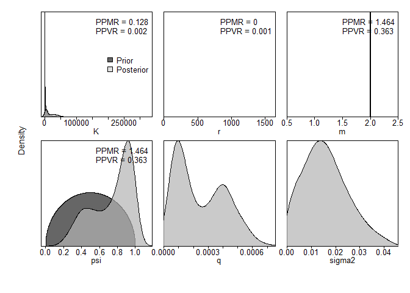
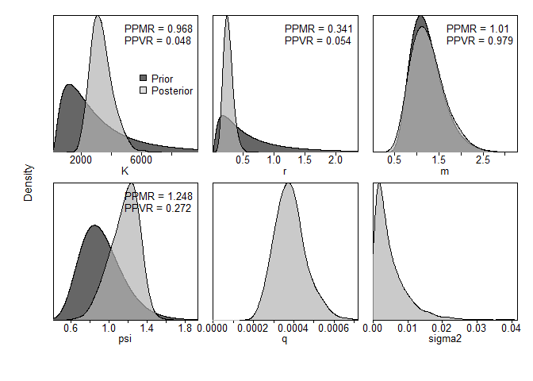

-   [データ](#データ)
-   [シナリオ1](#シナリオ1)
    -   [データの整理](#データの整理)
    -   [設定](#設定)
        -   [MCMCの実行](#mcmcの実行)
        -   [結果の出力](#結果の出力)
-   [シナリオ1 (事前分布強め)](#シナリオ1-事前分布強め)
    -   [レトロスペクティブ解析の実行](#レトロスペクティブ解析の実行)
-   [シナリオ2](#シナリオ2)
    -   [レトロスペクティブ解析の実行](#レトロスペクティブ解析の実行-1)
-   [シナリオ3](#シナリオ3)
    -   [レトロスペクティブ解析の実行](#レトロスペクティブ解析の実行-2)
-   [参考資料](#参考資料)

データ
======

`library(spict)`に内蔵のデータを使う

``` r
par(mfrow=c(2,2))
# Albacore
plot(dat$albacore$timeC, dat$albacore$obsC, type = "h",
     lwd=2, col = "red", main = "Albacore", ylim = c(0, max(dat$albacore$obsC)),
     xlab = "Year", ylab = "Catch")
par(new=T)
plot(dat$albacore$timeI, dat$albacore$obsI, lwd=2,
     type = "l", lty = 2, yaxt = "n",
     xlab = "", ylab = "")
# Lobster
plot(dat$lobster$timeC, dat$lobster$obsC, type = "h",
     lwd=2, col = "red", main = "Lobster", ylim = c(0, max(dat$lobster$obsC)),
     xlab = "Year", ylab = "Catch")
par(new=T)
plot(dat$lobster$timeI, dat$lobster$obsI, lwd=2,
     type = "l", lty = 2, yaxt = "n",
     xlab = "", ylab = "")
# Hake
plot(dat$hake$timeC, dat$hake$obsC, type = "h",
     lwd=2, col = "red", main = "Hake", ylim = c(0, max(dat$hake$obsC)),
     xlab = "Year", ylab = "Catch")
par(new=T)
plot(dat$hake$timeI, dat$hake$obsI, lwd=2,
     type = "l", lty = 2, yaxt = "n",
     xlab = "", ylab = "")
```


-   albacore
    -   意外に時系列が短い
    -   漁獲量はほぼ横ばい
    -   CPUEは淡々と減少
    -   =\> プロダクションモデルと相性良くない気がする
-   lobster
    -   `spict`データ内では一番時系列が長い
    -   漁獲量は55年にピークで、そこから少し減ってほぼ横這い
    -   85年からの5年ほどは漁獲量が減少傾向
    -   CPUEは50年代はピーキー
    -   55年以降は単調減少
    -   =\>
        CPUE減少、漁獲量一定は相性が悪いけど、時系列が長いのでやりやすいかも？
-   **hake**
    -   時系列は23年と短めだけど十分推定はできると思う
    -   漁獲量も獲れる獲れないのコントラストが一番みられる
    -   漁獲量が落ち込む80年前後に併せて、CPUEも低位になる
    -   82年以降の漁獲量増加とともに、CPUEも上がっていく
    -   =\> 増加の情報があって良いのではないか

<font color="Red">**今回はHakeのデータを使って比較してみる**</font>

シナリオ1
=========

-   データ: Hake

-   形状パラメータ: m=2 (Schaefer型)

-   観測誤差

    -   O: CPUE
    -   O: Catch

-   過程誤差あり

-   事前分布は出来る限り無情報にしてみる

    -   rとKは対数正規になるので、分散を大きく
    -   初期枯渇率は無情報にするとエラーが出るので*α* = *β* = 0.5と台地型に
    -   分散は逆ガンマ分布なので、*α* = *β* = 1として0.5に山が来て、その後なだらかに減少みたいな

データの整理
------------

``` r
dat_hake <- list(
  cpue = data.frame(Year = dat$hake$timeI,
                    CPUE = dat$hake$obsI),
  se = data.frame(Year = dat$hake$timeI,
                  CPUE = rep(NA, length(dat$hake$timeI))),
  catch = data.frame(Year = dat$hake$timeC,
                     catch = dat$hake$obsC)
  )
```

設定
----

引数の説明

-   事前分布
    -   増加率、環境収容力ともに対数正規型
        -   `"lnorm"`: 平均と分散を指定
        -   `"range"`: 上下限に収まるような対数正規を決めてくれる
    -   初期枯渇率
        -   `"lnorm"`: 平均と分散を指定して対数正規型
        -   `"beta"`: ベータ分布
    -   過程誤差/観測誤差
        -   `"igammma"`: 逆ガンマ分布の*α*と*β*
-   観測誤差の構造
    -   $TOE = \\sqrt{SE^2+sigma.est^2+fixed.obs^2}$
    -   SE（データの変動係数など）は無
    -   `fixed.obs`も無

``` r
jbinput_hake1 <-  build_jabba(
  catch = dat_hake$catch,
  cpue = dat_hake$cpue,
  se = dat_hake$se,
  assessment="test_hake",
  scenario = "TestRun",
  model.type = "Schaefer",
  add.catch.CV = TRUE,
  # prior sets
  r.dist = "lnorm",
  r.prior = c(0.5,5),
  K.dist = "lnorm",
  K.prior = c(10*max(dat_hake$catch$catch), 20),
  psi.dist = "beta",
  psi.prior = c(0.5,0.5),
  # variance sets
  sigma.proc = TRUE,
  igamma = c(0.001, 0.001),
  sigma.est = TRUE, # additional observation variance
  fixed.obsE = 0.)
```

    ## 
    ##  ><> Prepare JABBA input data <>< 
    ##  
    ## 
    ##  ><> Assume Catch with error CV =  0.1  <>< 
    ##  
    ## 
    ##  ><> Model type: Schaefer  <>< 
    ## 
    ##  ><> Shape m = 2 
    ## 
    ##  ><> K prior mean = 6060.84 and CV = 20 (log.sd =  2.448257 ) 
    ## 
    ##  ><> r prior mean = 0.5 and CV = 268337.3 (log.sd =  5 ) 
    ## 
    ##  ><> Psi (B1/K) prior mean = 0.5 and CV = 0.5 with beta destribution 
    ## 
    ##  
    ##  
    ##  ><> ALWAYS ENSURE to adjust default settings to your specific stock <>< 
    ## 

### MCMCの実行

``` r
fit_hake1 <- fit_jabba(jbinput_hake1, quickmcmc=TRUE)
```

    ## module glm loaded

    ## Compiling model graph
    ##    Resolving undeclared variables
    ##    Allocating nodes
    ## Graph information:
    ##    Observed stochastic nodes: 75
    ##    Unobserved stochastic nodes: 78
    ##    Total graph size: 1352
    ## 
    ## Initializing model
    ## 
    ## 
    ## ><> Produce results output of Schaefer model for test_hake TestRun <><
    ## 
    ## 
    ## ><> Scenario TestRun_Schaefer completed in 0 min and 30 sec <><

``` r
knitr::kable(fit_hake1$pars)
```

|        |        Median|           LCI|            UCI|  Geweke.p|  Heidel.p|
|:-------|-------------:|-------------:|--------------:|---------:|---------:|
| K      |  9484.6762460|  2377.5836755|  55877.6644746|     0.855|     0.406|
| r      |     0.0935643|     0.0000130|      0.4728215|     0.511|     0.739|
| q      |     0.0002084|     0.0000484|      0.0005683|     0.763|     0.602|
| psi    |     0.8148630|     0.2771444|      0.9883167|     0.785|     0.826|
| sigma2 |     0.0149417|     0.0011045|      0.0364607|     0.514|     0.493|
| tau2   |     0.0023338|     0.0004324|      0.0159377|     0.348|     0.679|
| m      |     2.0000000|     2.0000000|      2.0000000|       NaN|        NA|

``` r
knitr::kable(fit_hake1$estimates)
```

|             |            mu|           lci|            uci|
|:------------|-------------:|-------------:|--------------:|
| K           |  9484.6762460|  2377.5836755|  55877.6644746|
| r           |     0.0935643|     0.0000130|      0.4728215|
| psi         |     0.8148630|     0.2771444|      0.9883167|
| sigma.proc  |     0.1220000|     0.0330000|      0.1910000|
| m           |     2.0000000|     2.0000000|      2.0000000|
| Hmsy        |     0.0470000|     0.0000000|      0.2360000|
| SBmsy       |  4742.3380000|  1188.7920000|  27938.8320000|
| MSY         |   237.0740000|     0.0970000|    475.0360000|
| bmsyk       |     0.5000000|     0.5000000|      0.5000000|
| P1965       |     0.8580000|     0.2800000|      1.2270000|
| P1988       |     0.3640000|     0.1090000|      0.6020000|
| B\_Bmsy.cur |     0.7290000|     0.2190000|      1.2050000|
| H\_Hmsy.cur |     1.3300000|     0.6020000|   4872.5490000|

### 結果の出力

``` r
jbplot_ppdist(fit_hake1)
```

    ## 
    ## ><> jbplot_ppist() - prior and posterior distributions  <><



``` r
par(mfrow = c(1,2))
jbplot_residuals(fit_hake1)
```

    ## 
    ## ><> jbplot_residuals() - JABBA residual plot  <><


``` r
jbplot_cpuefits(fit_hake1)
```

    ## 
    ## ><> jbplot_cpue() - fits to CPUE <><


``` r
par(mfrow=c(3,2),mar = c(3.5, 3.5, 0.5, 0.1))
jbplot_trj(fit_hake1,type="B",add=T)
```

    ## 
    ## ><> jbplot_trj() - B trajectory  <><

``` r
jbplot_trj(fit_hake1,type="F",add=T)
```

    ## 
    ## ><> jbplot_trj() - F trajectory  <><

``` r
jbplot_trj(fit_hake1,type="BBmsy",add=T)
```

    ## 
    ## ><> jbplot_trj() - BBmsy trajectory  <><

``` r
jbplot_trj(fit_hake1,type="FFmsy",add=T)
```

    ## 
    ## ><> jbplot_trj() - FFmsy trajectory  <><

``` r
jbplot_spphase(fit_hake1,add=T)
```

    ## 
    ## ><> jbplot_spphase() - JABBA Surplus Production Phase Plot  <><

``` r
jbplot_kobe(fit_hake1,add=T)
```

    ## 
    ## ><> jbplot_kobe() - Stock Status Plot  <><

    ## Warning in bkfe(gcounts, 6L, alpha, range.x = c(sa, sb), binned = TRUE): Binning
    ## grid too coarse for current (small) bandwidth: consider increasing 'gridsize'

    ## Warning in bkfe(gcounts, 4L, alpha, range.x = c(sa, sb), binned = TRUE): Binning
    ## grid too coarse for current (small) bandwidth: consider increasing 'gridsize'

    ## Warning in bkde2D(x, bandwidth = bandwidth * factor, gridsize = nbins, ...):
    ## Binning grid too coarse for current (small) bandwidth: consider increasing
    ## 'gridsize'


SPICTと結果が違う

-   JABBAの方が不確実性を大きく推定するように見える(MCMCだから?)
-   JABBAのF/Fmsyとかは現実的に見えない
-   事前分布を無情報にするのが無理なのかな…

シナリオ1 (事前分布強め)
========================

``` r
jbinput_hake1.2 <-  build_jabba(
  catch = dat_hake$catch,
  cpue = dat_hake$cpue,
  se = dat_hake$se,
  assessment="test_hake",
  scenario = "TestRun",
  model.type = "Schaefer",
  add.catch.CV = TRUE,
  catch.cv = 0.19,
  # prior sets
  r.dist = "lnorm",
  r.prior = c(0.46,1),
  K.dist = "lnorm",
  K.prior = c(2407, 1),
  # variance sets
  sigma.proc = TRUE,
  igamma = c(0.001, 0.001),
  sigma.est = TRUE, # additional observation variance
  fixed.obsE = 0.)
```

    ## 
    ##  ><> Prepare JABBA input data <>< 
    ##  
    ## 
    ##  ><> Assume Catch with error CV =  0.19  <>< 
    ##  
    ## 
    ##  ><> Model type: Schaefer  <>< 
    ## 
    ##  ><> Shape m = 2 
    ## 
    ##  ><> K prior mean = 2407 and CV = 1 (log.sd =  0.8325546 ) 
    ## 
    ##  ><> r prior mean = 0.46 and CV = 1.310832 (log.sd =  1 ) 
    ## 
    ##  ><> Psi (B1/K) prior mean = 0.9 and CV = 0.25 with lnorm destribution 
    ## 
    ##  
    ##  
    ##  ><> ALWAYS ENSURE to adjust default settings to your specific stock <>< 
    ## 

``` r
fit_hake1.2 <- fit_jabba(jbinput_hake1.2, quickmcmc=TRUE)
```

    ## Compiling model graph
    ##    Resolving undeclared variables
    ##    Allocating nodes
    ## Graph information:
    ##    Observed stochastic nodes: 75
    ##    Unobserved stochastic nodes: 78
    ##    Total graph size: 1356
    ## 
    ## Initializing model
    ## 
    ## 
    ## ><> Produce results output of Schaefer model for test_hake TestRun <><
    ## 
    ## 
    ## ><> Scenario TestRun_Schaefer completed in 0 min and 22 sec <><

``` r
knitr::kable(fit_hake1.2$pars)
```

|        |        Median|           LCI|           UCI|  Geweke.p|  Heidel.p|
|:-------|-------------:|-------------:|-------------:|---------:|---------:|
| K      |  2929.9815210|  1918.1294948|  5594.1284112|     0.575|     0.948|
| r      |     0.3658252|     0.1849429|     0.5770013|     0.383|     0.731|
| q      |     0.0004057|     0.0002368|     0.0006907|     0.682|     0.936|
| psi    |     1.2244016|     0.8882066|     1.4232620|     0.429|     0.561|
| sigma2 |     0.0032286|     0.0004525|     0.0207975|     0.456|     0.483|
| tau2   |     0.0023203|     0.0004039|     0.0128240|     0.089|     0.235|
| m      |     2.0000000|     2.0000000|     2.0000000|       NaN|        NA|

``` r
knitr::kable(fit_hake1.2$estimates)
```

|             |            mu|           lci|           uci|
|:------------|-------------:|-------------:|-------------:|
| K           |  2929.9815210|  1918.1294948|  5594.1284112|
| r           |     0.3658252|     0.1849429|     0.5770013|
| psi         |     1.2244016|     0.8882066|     1.4232620|
| sigma.proc  |     0.0570000|     0.0210000|     0.1440000|
| m           |     2.0000000|     2.0000000|     2.0000000|
| Hmsy        |     0.1830000|     0.0920000|     0.2890000|
| SBmsy       |  1464.9910000|   959.0650000|  2797.0640000|
| MSY         |   267.1960000|   211.5400000|   336.3200000|
| bmsyk       |     0.5000000|     0.5000000|     0.5000000|
| P1965       |     1.2570000|     0.9250000|     1.3790000|
| P1988       |     0.5640000|     0.3860000|     0.6790000|
| B\_Bmsy.cur |     1.1280000|     0.7720000|     1.3590000|
| H\_Hmsy.cur |     0.7060000|     0.5320000|     1.0920000|

-   KはSPICT(2407)より大きめ
-   代わりにrはSPICT(0.46)より小さめ

``` r
jbplot_ppdist(fit_hake1.2)
```

    ## 
    ## ><> jbplot_ppist() - prior and posterior distributions  <><


``` r
par(mfrow = c(1,2))
jbplot_residuals(fit_hake1.2)
```

    ## 
    ## ><> jbplot_residuals() - JABBA residual plot  <><


``` r
jbplot_cpuefits(fit_hake1.2)
```

    ## 
    ## ><> jbplot_cpue() - fits to CPUE <><


``` r
par(mfrow=c(3,2),mar = c(3.5, 3.5, 0.5, 0.1))
jbplot_trj(fit_hake1.2,type="B",add=T)
```

    ## 
    ## ><> jbplot_trj() - B trajectory  <><

``` r
jbplot_trj(fit_hake1.2,type="F",add=T)
```

    ## 
    ## ><> jbplot_trj() - F trajectory  <><

``` r
jbplot_trj(fit_hake1.2,type="BBmsy",add=T)
```

    ## 
    ## ><> jbplot_trj() - BBmsy trajectory  <><

``` r
jbplot_trj(fit_hake1.2,type="FFmsy",add=T)
```

    ## 
    ## ><> jbplot_trj() - FFmsy trajectory  <><

``` r
jbplot_spphase(fit_hake1.2,add=T)
```

    ## 
    ## ><> jbplot_spphase() - JABBA Surplus Production Phase Plot  <><

``` r
jbplot_kobe(fit_hake1.2,add=T)
```

    ## 
    ## ><> jbplot_kobe() - Stock Status Plot  <><


### レトロスペクティブ解析の実行

5年間遡ってみる。

``` r
jbplot_retro(hc,as.png = F,single.plots = F)
```

    ## 
    ## ><> jbplot_retro() - retrospective analysis <><


    ##                  B           F         Bmsy        Fmsy        BtoB0        MSY
    ## 1988    0.03517132 -0.03397633  0.014425746 -0.02729388  0.014425746 0.01367346
    ## 1987   -0.01119987  0.01132673  0.030940888 -0.05928875  0.030940888 0.03124957
    ## 1986   -0.02785628  0.02865448  0.016206784 -0.05425079  0.016206784 0.03909801
    ## 1985   -0.03810323  0.03961260 -0.006245104 -0.02894331 -0.006245104 0.03314601
    ## 1984   -0.04254669  0.04443735 -0.015475441 -0.01636524 -0.015475441 0.03414156
    ## rho.mu -0.01690695  0.01801097  0.007970574 -0.03722839  0.007970574 0.03026172

シナリオ2
=========

-   データ: Hake
-   形状パラメータ: mの推定
-   観測誤差
    -   O: CPUE
    -   O: Catch
-   過程誤差あり

``` r
jbinput_hake2 <-  build_jabba(
  catch = dat_hake$catch,
  cpue = dat_hake$cpue,
  se = dat_hake$se,
  assessment="test_hake",
  scenario = "TestRun",
  model.type = "Pella_m",
  add.catch.CV = TRUE,
  catch.cv = 0.289,
  # prior sets
  r.dist = "lnorm",
  r.prior = c(0.46,1),
  K.dist = "lnorm",
  K.prior = c(2407, 1),

  # variance sets
  sigma.proc = TRUE,
  igamma = c(0.001, 0.001),
  sigma.est = TRUE, # additional observation variance
  fixed.obsE = 0.)
```

    ## 
    ##  ><> Prepare JABBA input data <>< 
    ##  
    ## 
    ##  ><> Assume Catch with error CV =  0.289  <>< 
    ##  
    ## 
    ##  ><> Model type: Pella_m  <>< 
    ## 
    ##  ><> Shape m is estmated with a mean 1.188 and a CV 0.3 
    ## 
    ##  ><> K prior mean = 2407 and CV = 1 (log.sd =  0.8325546 ) 
    ## 
    ##  ><> r prior mean = 0.46 and CV = 1.310832 (log.sd =  1 ) 
    ## 
    ##  ><> Psi (B1/K) prior mean = 0.9 and CV = 0.25 with lnorm destribution 
    ## 
    ##  
    ##  
    ##  ><> ALWAYS ENSURE to adjust default settings to your specific stock <>< 
    ## 

``` r
fit_hake2 <- fit_jabba(jbinput_hake2, quickmcmc=TRUE)
```

    ## Compiling model graph
    ##    Resolving undeclared variables
    ##    Allocating nodes
    ## Graph information:
    ##    Observed stochastic nodes: 75
    ##    Unobserved stochastic nodes: 79
    ##    Total graph size: 1360
    ## 
    ## Initializing model
    ## 
    ## 
    ## ><> Produce results output of Pella_m model for test_hake TestRun <><
    ## 
    ## 
    ## ><> Scenario TestRun_Pella_m completed in 0 min and 26 sec <><

``` r
knitr::kable(fit_hake2$pars)
```

|        |        Median|           LCI|           UCI|  Geweke.p|  Heidel.p|
|:-------|-------------:|-------------:|-------------:|---------:|---------:|
| K      |  3272.2125881|  2163.8905550|  5051.8096719|     0.342|     0.748|
| r      |     0.2485918|     0.1295367|     0.4285907|     0.874|     0.434|
| q      |     0.0003770|     0.0002479|     0.0005571|     0.838|     0.659|
| psi    |     1.1829056|     0.8290657|     1.4071794|     0.602|     0.685|
| sigma2 |     0.0033903|     0.0005022|     0.0178426|     0.130|     0.403|
| tau2   |     0.0024791|     0.0004270|     0.0129387|     0.175|     0.051|
| m      |     1.2026249|     0.6526546|     2.1170194|     0.955|     0.542|

``` r
knitr::kable(fit_hake2$estimates)
```

|             |            mu|           lci|           uci|
|:------------|-------------:|-------------:|-------------:|
| K           |  3272.2125881|  2163.8905550|  5051.8096719|
| r           |     0.2485918|     0.1295367|     0.4285907|
| psi         |     1.1829056|     0.8290657|     1.4071794|
| sigma.proc  |     0.0580000|     0.0220000|     0.1340000|
| m           |     1.2026249|     0.6526546|     2.1170194|
| Hmsy        |     0.2050000|     0.1170000|     0.3480000|
| SBmsy       |  1310.7630000|   807.3500000|  2124.9760000|
| MSY         |   268.7450000|   206.8490000|   343.0480000|
| bmsyk       |     0.4020000|     0.2930000|     0.5110000|
| P1965       |     1.2110000|     0.8520000|     1.3690000|
| P1988       |     0.5420000|     0.3750000|     0.6690000|
| B\_Bmsy.cur |     1.3340000|     0.9140000|     1.9380000|
| H\_Hmsy.cur |     0.5930000|     0.3610000|     0.9780000|

``` r
jbplot_ppdist(fit_hake2)
```

    ## 
    ## ><> jbplot_ppist() - prior and posterior distributions  <><



``` r
par(mfrow = c(1,2))
jbplot_residuals(fit_hake2)
```

    ## 
    ## ><> jbplot_residuals() - JABBA residual plot  <><


``` r
jbplot_cpuefits(fit_hake2)
```

    ## 
    ## ><> jbplot_cpue() - fits to CPUE <><


``` r
par(mfrow=c(3,2),mar = c(3.5, 3.5, 0.5, 0.1))
jbplot_trj(fit_hake2,type="B",add=T)
```

    ## 
    ## ><> jbplot_trj() - B trajectory  <><

``` r
jbplot_trj(fit_hake2,type="F",add=T)
```

    ## 
    ## ><> jbplot_trj() - F trajectory  <><

``` r
jbplot_trj(fit_hake2,type="BBmsy",add=T)
```

    ## 
    ## ><> jbplot_trj() - BBmsy trajectory  <><

``` r
jbplot_trj(fit_hake2,type="FFmsy",add=T)
```

    ## 
    ## ><> jbplot_trj() - FFmsy trajectory  <><

``` r
jbplot_spphase(fit_hake2,add=T)
```

    ## 
    ## ><> jbplot_spphase() - JABBA Surplus Production Phase Plot  <><

``` r
jbplot_kobe(fit_hake2,add=T)
```

    ## 
    ## ><> jbplot_kobe() - Stock Status Plot  <><


### レトロスペクティブ解析の実行

5年間遡ってみる。

``` r
jbplot_retro(hc,as.png = F,single.plots = F)
```

    ## 
    ## ><> jbplot_retro() - retrospective analysis <><


    ##                   B            F         Bmsy         Fmsy        BtoB0
    ## 1988    0.004853545 -0.004830102  0.035105334 -0.050254722  0.039011367
    ## 1987    0.032074424 -0.031077627  0.021449257 -0.045435549  0.037456616
    ## 1986   -0.010978806  0.011100678  0.004627095 -0.038801637  0.015446605
    ## 1985   -0.056101345  0.059435773 -0.043217789  0.028898944 -0.036935583
    ## 1984   -0.040847761  0.042587360 -0.070925105  0.073347845 -0.053163035
    ## rho.mu -0.014199989  0.015443216 -0.010592241 -0.006449024  0.000363194
    ##                MSY
    ## 1988   0.019698998
    ## 1987   0.029206163
    ## 1986   0.033455896
    ## 1985   0.017806414
    ## 1984   0.009314237
    ## rho.mu 0.021896342

シナリオ3
=========

-   データ: Hake

-   形状パラメータ: m=2 (Schaefer型)

-   観測誤差

    -   O: CPUE
    -   **X: Catch**

-   過程誤差あり

-   事前分布は出来る限り無情報にしてみる

    -   rとKは対数正規になるので、分散を大きく
    -   初期枯渇率は無情報にするとエラーが出るので*α* = *β* = 0.5と台地型に
    -   分散は逆ガンマ分布なので、*α* = *β* = 1として0.5に山が来て、その後なだらかに減少みたいな

``` r
jbinput_hake3 <-  build_jabba(
  catch = dat_hake$catch,
  cpue = dat_hake$cpue,
  se = dat_hake$se,
  assessment="test_hake",
  scenario = "TestRun",
  model.type = "Schaefer",
  add.catch.CV = FALSE,
  # prior sets
  r.dist = "lnorm",
  r.prior = c(0.44,1),
  K.dist = "lnorm",
  K.prior = c(2534, 1),
  # variance sets
  sigma.proc = TRUE,
  igamma = c(0.001, 0.001),
  sigma.est = TRUE, # additional observation variance
  fixed.obsE = 0.)
```

    ## 
    ##  ><> Prepare JABBA input data <>< 
    ##  
    ## 
    ##  ><> Assume Catch to be known without error <>< 
    ##  
    ## 
    ##  ><> Model type: Schaefer  <>< 
    ## 
    ##  ><> Shape m = 2 
    ## 
    ##  ><> K prior mean = 2534 and CV = 1 (log.sd =  0.8325546 ) 
    ## 
    ##  ><> r prior mean = 0.44 and CV = 1.310832 (log.sd =  1 ) 
    ## 
    ##  ><> Psi (B1/K) prior mean = 0.9 and CV = 0.25 with lnorm destribution 
    ## 
    ##  
    ##  
    ##  ><> ALWAYS ENSURE to adjust default settings to your specific stock <>< 
    ## 

``` r
fit_hake3 <- fit_jabba(jbinput_hake3, quickmcmc=TRUE)
```

    ## Compiling model graph
    ##    Resolving undeclared variables
    ##    Allocating nodes
    ## Graph information:
    ##    Observed stochastic nodes: 75
    ##    Unobserved stochastic nodes: 54
    ##    Total graph size: 1283
    ## 
    ## Initializing model
    ## 
    ## 
    ## ><> Produce results output of Schaefer model for test_hake TestRun <><
    ## 
    ## 
    ## ><> Scenario TestRun_Schaefer completed in 0 min and 19 sec <><

``` r
knitr::kable(fit_hake3$pars)
```

|        |        Median|           LCI|           UCI|  Geweke.p|  Heidel.p|
|:-------|-------------:|-------------:|-------------:|---------:|---------:|
| K      |  2935.8757917|  2177.1146498|  4508.2368240|     0.981|     0.246|
| r      |     0.3616328|     0.2094652|     0.5220186|     0.716|     0.054|
| q      |     0.0003908|     0.0002602|     0.0005618|     0.590|     0.275|
| psi    |     1.2388297|     0.9762065|     1.4257003|     0.739|     0.737|
| sigma2 |     0.0031555|     0.0004969|     0.0175393|     0.987|     0.846|
| tau2   |     0.0025480|     0.0004457|     0.0130900|     0.892|     0.658|
| m      |     2.0000000|     2.0000000|     2.0000000|       NaN|        NA|

``` r
knitr::kable(fit_hake3$estimates)
```

|             |            mu|           lci|           uci|
|:------------|-------------:|-------------:|-------------:|
| K           |  2935.8757917|  2177.1146498|  4508.2368240|
| r           |     0.3616328|     0.2094652|     0.5220186|
| psi         |     1.2388297|     0.9762065|     1.4257003|
| sigma.proc  |     0.0560000|     0.0220000|     0.1320000|
| m           |     2.0000000|     2.0000000|     2.0000000|
| Hmsy        |     0.1810000|     0.1050000|     0.2610000|
| SBmsy       |  1467.9380000|  1088.5570000|  2254.1180000|
| MSY         |   265.8450000|   213.9630000|   320.8140000|
| bmsyk       |     0.5000000|     0.5000000|     0.5000000|
| P1965       |     1.2700000|     1.0260000|     1.3810000|
| P1988       |     0.5830000|     0.4410000|     0.6880000|
| B\_Bmsy.cur |     1.1660000|     0.8820000|     1.3770000|
| H\_Hmsy.cur |     0.6850000|     0.5350000|     0.9980000|

``` r
jbplot_ppdist(fit_hake3)
```

    ## 
    ## ><> jbplot_ppist() - prior and posterior distributions  <><


``` r
par(mfrow = c(1,2))
jbplot_residuals(fit_hake3)
```

    ## 
    ## ><> jbplot_residuals() - JABBA residual plot  <><


``` r
jbplot_cpuefits(fit_hake3)
```

    ## 
    ## ><> jbplot_cpue() - fits to CPUE <><


``` r
par(mfrow=c(3,2),mar = c(3.5, 3.5, 0.5, 0.1))
jbplot_trj(fit_hake3,type="B",add=T)
```

    ## 
    ## ><> jbplot_trj() - B trajectory  <><

``` r
jbplot_trj(fit_hake3,type="F",add=T)
```

    ## 
    ## ><> jbplot_trj() - F trajectory  <><

``` r
jbplot_trj(fit_hake3,type="BBmsy",add=T)
```

    ## 
    ## ><> jbplot_trj() - BBmsy trajectory  <><

``` r
jbplot_trj(fit_hake3,type="FFmsy",add=T)
```

    ## 
    ## ><> jbplot_trj() - FFmsy trajectory  <><

``` r
jbplot_spphase(fit_hake3,add=T)
```

    ## 
    ## ><> jbplot_spphase() - JABBA Surplus Production Phase Plot  <><

``` r
jbplot_kobe(fit_hake3,add=T)
```

    ## 
    ## ><> jbplot_kobe() - Stock Status Plot  <><


### レトロスペクティブ解析の実行

5年間遡ってみる。

``` r
jbplot_retro(hc,as.png = F,single.plots = F)
```

    ## 
    ## ><> jbplot_retro() - retrospective analysis <><


    ##                   B            F         Bmsy        Fmsy        BtoB0
    ## 1988   -0.003473086  0.003485190  0.014238280 -0.03290845  0.014238280
    ## 1987   -0.012940407  0.013110055  0.027185436 -0.05633860  0.027185436
    ## 1986    0.008511560 -0.008439724  0.028972160 -0.05761350  0.028972160
    ## 1985   -0.016033905  0.016295181 -0.003528853 -0.03746003 -0.003528853
    ## 1984   -0.063185403  0.067447075 -0.014674739 -0.02780713 -0.014674739
    ## rho.mu -0.017424248  0.018379555  0.010438457 -0.04242554  0.010438457
    ##               MSY
    ## 1988   0.02028834
    ## 1987   0.03218288
    ## 1986   0.03284297
    ## 1985   0.04044461
    ## 1984   0.04285553
    ## rho.mu 0.03372287

参考資料
========

あまり参考にならないが、[ここ](https://github.com/jabbamodel/JABBA/blob/master/Tutorial_Vignette.md)にJABBAのチュートリアルがある
